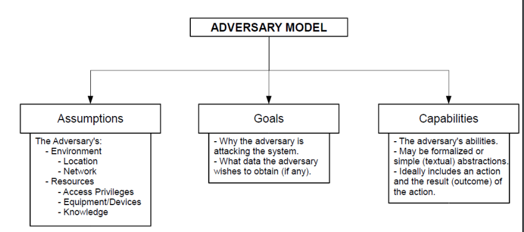
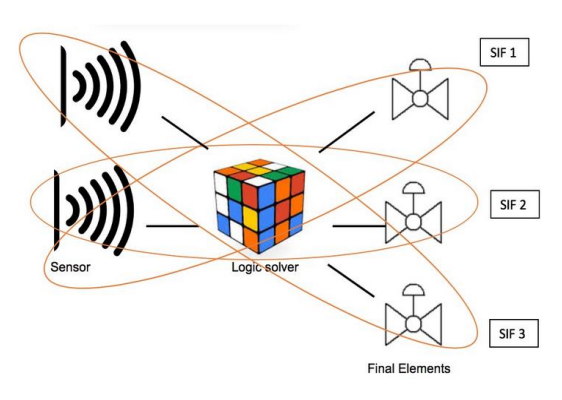
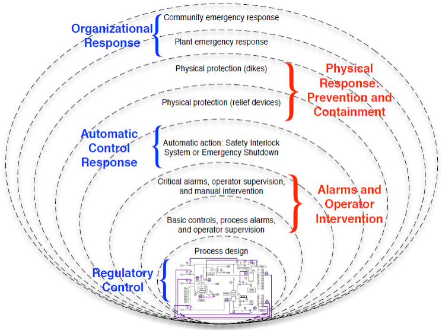
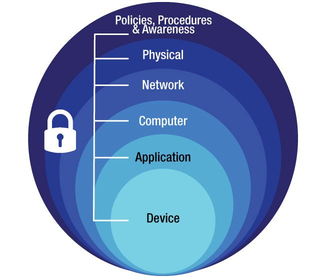

## Characteristics of CPS

The work on CPS security is relatively new, and the community has not yet developed the same consensus on best security practices compared to other cyber security fields.

CPS systems do not need or have the computing power of classical computers, therefore having limited resources. Very often, they do not even run operating systems - instead, they run firmware (a class of software that provides low-level control of the device hardware). Devices without an OS are also known as bare metal systems.

Network protocols are progressing. Within the last 2 decades, the communication between parts of the system is migrating from serial communication to IP-compatible networks.

For example, what was previously Modbus protocol over serial connection is now changed to Modbus TCP or Profibus which is now evolved from RS485 to Profinet (using TCP/IP & Ethernet).

Many CPSs are designed to be real-time. Additionally, CPSs are typically large scale deployment meaning that intentional or accidental exposures of these systems can result into catastrophic effects.

## Challenges

When designing or dealing with a CPS there are several challenges that need to be considered. These challenges impact the safety and security of the CPS and the public. Some of these challenges are:

- Interoperability
- Predictability
- Reliability
- Sustainability
- Dependability
- Security

### Interoperability

Systems that are designed following a standard design and specification specifically ones that are designed using open standards are often interoperable. In an interoperable system, the system components can work together, they can communicate, exchange information to provide services that improves the scalability, compatibility, diversity and efficiency of the system.

They work with other products or systems (compatibility and integration) without any customization or effort. An example are USB devices - you can expect compatibility with many devices (laptops, desktops, smart TVs, etc...)

### Predictability

Being able to expect the state, behaviour and functionality of the system. A predictable system should guarantee that the desired outcome of the system with high accuracy while meeting the requirements at all times.

### Reliability

Correctness of the system when performing its functionality. Breaks down into:

- Robustness
- Validity
- Maintainability - ease with which a product can be maintained in order to correct defects or their cause, repair or replace faulty or worn-out components without having to replace the working parts prevents unexpected working conditions, maximize a product's useful life span, maximize efficiency, reliability, and safety, meet new requirements, make future maintenance easier or cope with a changing environment.

### Sustainability

An adaptive, resilient and reconfigurable system that is capable of functioning and enduring without compromising the system requirements. A sustainable system should be long-lasting, self healing and be able to dynamically evolve.

### Dependability

A dependable system is trustworthy to its users. It is highly available (to legitimate users) while ensuring a high degree of service integrity. It provides its expected functionalities without degradation in its performance. Some of the features od a dependable system are:

- Reliability
- Maintainability
- Availability
- Safety/Integrity

### Security

Providing a secure system through the use of software and hardware to ensure the system meets the required CIA - Confidentiaility, Integrity, Availability.

## Security

Cyber physical systems are more and more becoming the target of attacks. Therefore, to secure them, it is important to understand the difference between securing CPS and IT systems (CPS vs IT) and create an adversary model to evaluate their security.

An adversary model is required if the security of the system is going to be examined and studied. This provides a description of the threat that the system could potentially face.

Two good videos that illustrate ICS security challenges and examples are the following:


 


Some things that need to be considered about an adversary or attacker in an adversary model are:

- Adversary assumptions - who wants to attack critical infrastructure CPS? Cybercriminals? Disgruntled employees? Terrorists?
- Adversary goals - what do they want to achieve or gain from the attack?
- Adversary capabilities - what sort of expertise, knowledge and tools do they have?

There are fundamental differences between the IT security and CPS security due to their different nature. With CPS security, availability is the most important security aspect for CPS, whereas confidentiality is the most important in IT systems.

IT systems also use DHCP in their protocol, whereas CPS uses static configuration (although not typically in the enterprise zone). Finally, IT systems need to receive frequent updates and patches, whereas this is not possible in CPS and they have very infrequent, if any updates.

## Keeping CPS Secure

There are a few concepts that should be considered for securing the CPS:

- Countermeasure
- Prevention
- Detection and recovery
- Deterrence
- Resilience

### Countermeasure

This is the measure or action taken to offset an attack. It's crucial to understand the attacker's intention and the consequence of an attack to design a countermeasure. It's also important to design new attack detection algorithms and attack-resilient algorithms (more on that later).

### Prevention

This requires developing schemes for securing the infrastructure. It includes things like regulations, forcing a standard and using best practices.

However, prevention is not always successful, therefore in case an attack happens it is important to be able to detect and recover from it. IT systems rely on the network traffic traces and logs. However, in CPS, there are physical processes that can be monitored, in addition to network traffic, allowing detections that are undetectable from the IT side.

You should also train human operators or intelligent agents to detect attacks and follow recovery protocols.

### Resilience

This describes the design of CPS systems that survive attacks through things like:

- Redundancy
- Separation of privilege
- Using control loops (can be interrupted by humans in case of disturbance)

### Deterence

This describes the act of discouraging attacks through the fear of its consequences:


If you can't do the time, don't do the crime!


This can include boring legal stuff like:

- Legislation
- Law enforcement
- International collaboration for tracking cybercrimes

Some of the aspects that should be considered when securing CPS are things like:

- Safety
- Protection
- Reliability
- Fault tolerance
- Robust Control
- Safety vs Security

## Safety

In terms of safety, the ICS ICE61508 standard recommends you to consider the likelihood of a given failure and their consequence and then design safety requirements (or SIS) to take into account all the causes of failure.

Safety instrumented systems (SIS) is a dedicated safety monitoring system that is independent of the main control system. They are there to safely and gracefully shut down the monitored system or bring that system to a predefined safe state in case of a hardware malfunction (i.e. pressure temperature release value to a full ICS).

A simple example is your boiler - if the temperature/pressure inside your boiler gets too high, there is likely an SIS that will stop whatever is necessary to stop it from exploding. It is just there to monitor the system and does NOT control the system itself.

SIS is an implementation of one or more Safety Instrumented Functions (SIF). A SIS is composed of any combination of sensors, logic solvers, and final elements. It usually has a number of safety functions with different safety integrity levels (SIL).

SIS typically have their own sensors/logic solver (PLC/RTU) and they will be able to activate some valves/switches/actuators to be able to control or engage some safety instrument to save the system from an uncontrolled state.

The purpose of SIS is to:

- Automatically take an industrial process to a safe state when specified conditions are violated
- Permit a process to move forward in a safe manner when specified conditions allow (permissive functions)
- Take action to mitigate the consequences of an industrial hazard

A helpful video to understand this is by RealPars:



An important aspect is that you have to follow rigorous standards when desigining an SIS. Some of these could related to your logic solver which should NOT be allowed to influence on-line changes to a logic solver (i.e. connected to different network, different power grid, etc...). They should be completely isolated.

In short, SIS consists of an engineered set of hardware and software controls which are especially used on critical process systems. The goal of SIS is to prevent an accident - e.g. by closing a fuel valve whenever a high pressure sensor raises an alarm.

One SIS may have multiple SIFs. Depending on the system designed, there may be different conditions that push the system into an unsafe state and there could be a functionality for each of those conditions.

## Defense-In-Depth Strategy

This refers to a cybersecurity approach that uses multiple layers of security for holistic protection. A layered defense helps security organizations reduce vulnerabilities, contain threats, and mitigate risks.

It is a holistic ICS security posture by stacking defenses, or in other words, by creating multiple backup security controls that cover and overlap each other. Therefore, in defense-in-depth approach, if a bad actor breaches one layer of defense, they might be contained by the next layer of defense.

An example for implementing defense in depth could be by starting from basic low priority alarms sent to a monitoring station, to the activation of SIS systems, to mitigation safeguards such as physical protection systems and organizational response protocols for a plant emergency response/evacuation.

Many of the core ICS systems and devices do not lend themselves well to following regular IT security strategies. Some of these restrictions include:

- Device related
- Network related
- Safety related
- Runtime and uptime requirements

### Device Related
Most ICS controls and automation devices are resource constrained. They are small form factor embedded devices with just enough memory and CPU cycles to get their job done, leaving no room for anything in excess of that. This prevents the manufacurer from implements power hungry and resource demanding security controls like authentication or encryption.

Apart from being resource restrained, ICS devices have an extremely long lifespan and are often in operation for several decades. Because of their age, they are often fragile, and adding security features, either running on the device directly or interfacing with them externally, could interrupt their proper functioning.

### Network Related
Many ICS run critical functions, where continuous, real-time communications and connection to process values is a must. The slightest disruption in connectivity could cause an unrecoverable fault state in the process.

For this reason, it is often not feasible to implement any type of bump in the wire security like a network firewall or Network Intrusion Detection System (NIDS). The latency or delay these systems introduce can be enough to bring a process down.

Bump-in-the-wire is a class of communications devices which can be inserted into existing systems to enhance the integrity, confidentiality or reliability of communications across an existing logical link without altering the communications endpoints.

### Safety Related
Safety-related restrictions are often involved with securing ICS devices and networks. The ICS controls the process and in case of an emergency, an operator must be able to quickly and accurately interact with the ICS to manipulate the process. Any delay or restriction can mean the difference between life and death (think Chernobyl!).

As an example, an operator cannot be expected to remember an 18-character randomly generated password that is necessary to log in to a HMI terminal in order to be able to stop an out-of-control system and prevent a total plant meltdown. Chances are they won't remember the password under stress.

Another consideration is the lockout policy for incorrect passwords; locking out users after repeated incorrect password attempts can prevent an operator from logging in to a system to make changes or interact, resulting in an unsafe situation.

### Runtime and Uptime Requirements
Many ICS run processes and production systems with extremely high uptime requirements. Even at 99.9% uptime, there will be 1 minute of downtime every 1000 minutes. Considering a production process, such as a flour mill, that runs for weeks or months at a time and where the slightest interruption will create considerable downtime, a minute every 1000 is unacceptable (1 month equals 30 x 24 x 60 = 43,200 minutes).

There is simply no time to do any maintenance, patching, or security related activities on systems with these kinds of uptime requirements. Compounding the matter is the fact that many ICSs have strict integrity requirements. The slightest change in the ICS setup or configuration will trigger a mandatory revalidation process for the entire ICS.

Because of these restrictions and requirements imposed on ICSs, typical security controls and activities like patching, implementing of firewalls and IDS or use of restrictive authentication, authorization and accounting methods are abandoned.

One defensive strategy that has been used extensively for ICS networks is security by obscurity. The idea is that by hiding or obscuring the ICS network, an attacker will not be able to find the network, and one cannot attack what one cannot find.

To a degree, this strategy worked really well when the ICS protocols and communication media were proprietary and or limited in what they could achieve. However, as ICS networks converge and start using common technologies and protocols like Ethernet and Internet Protocol (IP), they are becoming more open in nature and easier to discover.

For example, earlier controllers would sit on a production floor and the only way to communicate with it was by physically attaching a serial cable and using a proprietary programming software package, using a proprietary communication protocol, running on a dedicated engineering laptop.

However, nowadays, the controllers can be accessed via Ethernet using the IP protocols. With the capability to route IP traffic, a controller can be accessed from anywhere. Needless to say, the security by obscurity philosophy as a defensive strategy is obsolete and highly inefficient in defending an ICS due to, in part, by the convergence of networks.

Another defensive strategy that is often used to secure and protect ICS networks is perimeter defense. With perimeter defense, a security appliance such as a firewall is placed at the edge of a network to inspect and filter all inbound and sometimes outbound traffic.

The idea behind the perimeter defense strategy is that by controlling and verifying all traffic coming into a network, the network is kept secure. No restrictions or traffic inspection is performed on the inner network.

What this model does not take into consideration is the state of the systems inside the network being protected. If systems that are already compromised are introduced into that network (i.e. an infected EWS), a perimeter defense strategy is useless.

Additionally, when a service is allowed through a firewall, for example by adding a firewall exception for a port to allow access to a web 80 server on the internal network, the perimeter firewall is effectively rendered useless and the perimeter defense strategy shattered.

The following is a perfect example of what happens to perimeter security controls if they are already inside:

If something were to compromise the web server on the inner network via the HTTP protocol, the compromised asset on the inner network could then be used as a pivot point to further attack the inner network.

By nature, ICS are very defendable. Because ICS systems tend to be stagnant in configuration, it is easier to detect anomalies. For example, it is relatively easy to establish a standard traffic pattern on a controls network and start looking for deviations from the normal.

Additionally, because ICS don't change very often, the environment they are in is easier to secure. So, on one hand, an ICS is horribly defenseless because restrictions and requirements do not allow for traditional IT security practices we are so used to. On the other hand, the very nature of ICS makes it extremely defendable.

However, don't get it twisted - no single solution can truly protect against all attack vectors and plug every security hole of a system. By applying a defense in-depth model and layering protective measures, gaps in the security of one layer can be closed by controls on another layer, creating a holistic security posture.

The way to address all the concerns involved with securing and defending an ICS is by implementing a defense in-depth strategy. I will cover each layer below.

#### Policies, Procedures and Awareness
Gluing all the security controls together are policies, procedures and awareness.

Policies are a high level guideline on what the expected security stance is for ICS systems and devices. For example, we shall encrypt all our databases.

Procedures are step-by-step instructions on how to accomplish policy goals, such as how to implement AES encryption on production recipe databases.

Awareness training helps get and keep attention on security-related aspects of the ICS and its operation. Awareness training often comes in the form of an annual security training that covers topics such as spam, insider threats, and tailgating practices.

#### Physical
This includes things like limiting physical access for authorized personnel to cell/area zones, control panels, devices, cabling, and control rooms, through the use of locks, gates, key cards and biometrics.

It may also involve using policies, procedures and technology to escort and track visitors.

The goal of physical security is to keep people out of areas they are not authorized to be in. This includes restricted areas, control rooms, high security areas, electrical and network panels, server rooms, and other restricted or sensitive area. If an attacker has physical access to network or computer equipment, it is only a matter of time until he or she gains access to the network or the computer system.

The physical defense layer, includes recommendations such as building sufficiently sized walls, applying door locks, installing CCTV cameras, and defining policies and controls to deal with visitors and guests.

#### Network
This is a security framework. For example, firewall policies, ACL policies for switches and routers, AAA (Authentication, Authorization and Accounting), intrusion detection, and prevention systems.

It essentially tries to restrict access to logical areas of the ICS network. The idea is to divide the network into security zones, using an IDMZ (industrial DMZ responsible for isolating the industrial network from the corporate network), applying firewall rules, setting up ACLs, and implementing IDS to fence off more sensitive parts (more secure zones) of the network from less secure zones.

By tightly controlling and monitoring traffic traversing the security zones, anomalies can be detected and handled effectively.

#### Computer
Things like patch management, anti-malware, software, removal of unused applications/protocols/services, closing unnecessary logical ports, and protecting physical ports.

Computer security is about preventing the infiltration of computer systems (workstations, servers, laptops, and so on). This is accomplished by applying patching strategies, performing hardening exercises for computer systems, and by installing security applications and solutions such as antivirus, endpoint protection, and host intrusion detection/prevention (HIDS / HIPS) software.

Restricting or preventing access to unused communication ports of computing devices, such as blocking access to USB and FireWire ports by means of physical port blockers as well as by applying a device policy with an endpoint protection solution such as Symantec Endpoint Protection SCP. Keeping computer systems free from vulnerabilities by updating and patching is also a form of computer security.

#### Application
Authentication, authorization and accounting (AAA) as well as vulnerability management, patch management and secure development life cycle management.

This is about preventing a user from performing unauthorized interactions with programs and services running on the computer system. This is accomplished by implementing authentication, authorization, and auditing. Here, authentication verifies that the user is who he or she claims to be, authorization restricts the users’ actions, and auditing logs all interactions the user has with the system.

Keeping applications free from vulnerabilities by detection and patching is also a form of application security

#### Device
Device hardening, communication encryption and restrictive access as well as patch management, device life cycle management, and configuration and change management.

Device security involves the actions and security controls concerning the AIC triad of ICS Devices (availability, integrity, and confidentiality). The acronym is deliberately turned around in order to reflect the priorities of the ICS environment.

For regular IT systems and networks, the order of the security triad is CIA, or confidentiality, integrity, and availability, but in the context of an ICS, availability comes before the others as uptime (availability) is the number one goal in production and has the greatest impact on profitability.

Device security includes device patching, device hardening, physical and logical access restrictions, and setting up a device life cycle program that involves defining procedures for device acquisition, implementation, maintenance, configuration and change management, and device disposal.

## Safety vs Security
Bear with me, this is a very short section about safety vs security in terms of ICS systems.

The addition of new security defences may pose safety concerns. For example, a power plant was shutdown because a computer rebooted after a patch.

Software updates and patching might violate safety certifications, and preventing unauthorized users from accessing a CPS might also prevent first responders from access to the system in the case of an emergency (e.g., paramedics might need access to a medical device that prevents unauthorised connections).

Security solutions should take these CPS safety concerns into account when designing and deploying new security mechanisms.