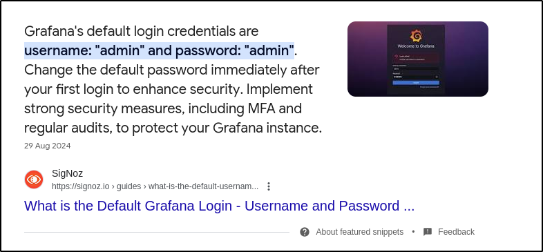

## Port Scanning

An initial Rustscan scan reveals:

```bash
rustscan -a 10.10.94.22 --ulimit 5000 --
```


Two ports appear to be open. A more detailed Nmap scan shows the following information:

```bash
nmap -Pn -A 10.10.94.22
```


Only SSH and a port on 3000 appear to be running (indicated as a web server by various HTTP responses such as 302 Found). Since SSH is not typically the way in without credentials or a private key, it's best to check out the web server first.
## Web Server Enumeration

Navigating to the site in a browser reveals a Grafana login page:


Searching for default credentials reveals them to be "admin:admin":



However, this proves unsuccessful. Attempting other weak credentials also proves unsuccessful such as:

- admin:password
- grafana:grafana
- admin:grafana

Since brute forcing is typically a last resort, it seems credentials are not the way in yet. Checking the source code for any mention of a version returns a version of 8.0.0:


## Grafana Version Enumeration

Searching for any vulnerabilities/exploits relating to this version returns a few results:


One thing in common between these links is a CVE. Researching this vulnerability reveals it to be a path traversal vulnerability and, most importantly, it is pre-auth meaning no login is required:




## CVE-2021-43798 Exploitation

Reading through the vulnerability, there is a public API endpoint allowing the viewing of plugin assets by providing a plugin ID and specifying a file path via `<grafana>/public/app/plugins/panel/pluginId`. In the PoC above, cURL is used to grab these files:

```bash
curl --path-as-is http://localhost:3000/public/plugins/alertlist/../../../../../../../../etc/passwd
```

Attempting this PoC against the machine results in success:


It works and various files can be read. Looking at the output of /etc/passwd, there are not many users (only root and grafana) with root really being the only user with a shell, indicating it may be a container of some kind, or just poorly managed.

Attempting to read the /etc/shadow file results in just HTML being returned:


### Dumping Interesting Files

Reading further down the GitHub page, it states that Grafana uses a sqlite3 database stored under `/var/lib/grafana/grafana.db`. It also states you can dump Grafana configuration from `<grafana>/conf/defaults.ini`. 


**Warning!** To download the binary database file, you must specify `--output [FILE]` or cURL will not work.



Downloading both results in success:

```bash
curl --path-as-is http://10.10.94.22:3000/public/plugins/alertlist/../../../../../../../../etc/passwd
curl --path-as-is http://10.10.94.22:3000/public/plugins/alertlist/../../../../../conf/defaults.ini
```


Checking the default configuration file for anything juicy (creds, usernames, hashes, subdomains, etc..) results in nothing:


## SQLite3 Enumeration

Opening the sqlite3 database and running the `.tables` command shows some interesting results:


Then, after dumping the interesting `user` table, some hashes appear to be present for two users:

- admin
- boris


## Cracking Hashes

Again, on the same GitHub, it states that Grafana encrypts all passwords using AES-256-CBC using a `secret_key` config file.. Searching around, there is a tool called Grafana2Hashcat that converts them into a format that Hashcat can use:




After running it on the hashes:

```bash
python3 grafana2hashcat.py grafana_hashes.txt
```


The two hashes get outputted. Now, Hashcat can be run against them with the standard `rockyou` wordlist:

```bash
hashcat -m 10900 crackme.txt /usr/share/wordlists/rockyou.txt
```


Now we have credentials! With these, SSH can be attempted as the `boris` user which results in a successful flag and the user flag can be grabbed:


## Post Exploitation Enumeration

After gaining access, checking SUDO permissions shows something interesting:


The boris user can run `docker exec` with a wildcard afterwards as the root user. Another thing to check from earlier with the `/etc/passwd`, the previous passwd file did not contain the boris user but did have a grafana user, while the one present via SSH contains `boris` but not `grafana`:


This indicates a high likelihood of Grafana being run in a container (as well as the fact docker seems to be installed here). 
## Docker Exec

After reading around and learning about `docker exec`, it appears most of the commands need the hostname of the docker container:


Using the LFI from earlier, the hostname of the Grafana container can be exfiltrated from `/etc/hostname`:


With the hostname, a test command can be ran to gain an interactive shell:

```bash
docker exec -it [CONTAINER-NAME] /bin/bash
```


This spawns an interactive shell on the Docker container as the "grafana" user and the `/etc/passwd` contents are the same as found via LFI before. Reading the man page and [Docker documentation](https://docs.docker.com/reference/cli/docker/container/exec/)) shows some interesting options:


Two options stand out to me:

- `--privileged`
- `--user`

The `--privileged` option provides various capabilities to the container:


Attempting to run Docker exec with the `-u` option first and specifying `root` proves successful and access is gained as the root user:


Since we have root access, the `--privileged` option may not be needed. Further research on how to escape Docker containers with root access revealed a [blog](https://www.panoptica.app/research/7-ways-to-escape-a-container) with various ways:


## Docker Escape

These techniques have some minimal Linux capabilities that must be available. To enumerate these, the `/proc/self/status` can be read and grepped for `Cap` which returns:

```bash
cat /proc/self/status | grep Cap
```


These capabilities are as follows:

- Effective capabilities (CapEff)
- Permitted capabilities (CapPrm)
- Inherited capabilities (CapInh)
- Ambient capabilities (CapAmb)
- Bounding set (CapBnd)

The values are not in human readable form, but can be easily translated to certain capabilities via a simple Python script I wrote:

```python
# List of all capabilities and their bit positions
capabilities = {
    0: "CAP_CHOWN",                   # 0
    1: "CAP_DAC_OVERRIDE",            # 1
    2: "CAP_DAC_READ_SEARCH",         # 2
    3: "CAP_FOWNER",                  # 3
    4: "CAP_SETPRIORITY",             # 4
    5: "CAP_SYS_ADMIN",               # 5
    6: "CAP_SYS_BOOT",                # 6
    7: "CAP_SYS_NICE",                # 7
    8: "CAP_SYS_RESOURCE",            # 8
    9: "CAP_SYS_TIME",                # 9
    10: "CAP_SYS_TTY_CONFIG",         # 10
    11: "CAP_MKNOD",                  # 11
    12: "CAP_AUDIT_WRITE",            # 12
    13: "CAP_AUDIT_CONTROL",          # 13
    14: "CAP_MAC_OVERRIDE",           # 14
    15: "CAP_MAC_ADMIN",              # 15
    16: "CAP_SYSLOG",                 # 16
    17: "CAP_WAKE_ALARM",             # 17
    18: "CAP_BLOCK_SUSPEND",          # 18
    19: "CAP_AUDIT_READ",             # 19
    20: "CAP_PERFMON",                # 20
    21: "CAP_SYS_ADMIN",              # 21
    22: "CAP_SYS_PTRACE",             # 22
    23: "CAP_SYS_PACCT",              # 23
    24: "CAP_SYS_ADMIN2",             # 24
    25: "CAP_SYS_EPOLL",              # 25
    26: "CAP_SYS_CPU",                # 26
    27: "CAP_SYS_INIT",               # 27
    28: "CAP_SYS_CHROOT",             # 28
    29: "CAP_SYS_AUDIT",              # 29
    30: "CAP_SYS_VMS",                # 30
    31: "CAP_SYS_VM",                 # 31
    32: "CAP_SYS_ALL",                # 32
    33: "CAP_SYS_KILL",               # 33
    34: "CAP_SYSLINUX_KILL",          # 34
    35: "CAP_EXIT"                    # 35
}

def decode_capabilities(cap_value_hex):
    # Convert hexadecimal string to integer
    cap_value = int(cap_value_hex, 16)
    
    # Iterate through all capabilities and check if the corresponding bit is set
    for bit, capability in capabilities.items():
        if cap_value & (1 << bit):
            print(f"Bit {bit}: {capability}")

# Example Usage:
cap_value_hex = "3fffffffff"  # Replace this with the capability hex string
decode_capabilities(cap_value_hex)
```

This script essentially maps the various capabilities to certain bits, translates the hexadecimal into an integer and checks if the corresponding bit is set (in this case, for value 3ffffffff) and prints out the capabilities:


As you can see, the values present as root in the Docker container translate to having all privileges which makes sense. There is also a [StackOverflow post](https://stackoverflow.com/questions/58924511/why-is-granting-the-sys-admin-privilege-for-a-docker-container-bad) asking why it is bad for a Docker container to have it, stating it is essentially root access to the host.


**Warning!** While you can just run the command to mount the file system and perform privilege escalation, it's always good to gain an understanding.


The blog continues and states the commands to escape the container are:

```bash
mount /dev/[DEVICE-FILE] /mnt
ls /mnt
```

To find the device file, many commands can be ran, including `fdisk -l`:

```bash
fdisk -l
```


Now, this device can be mounted:

```bash
mkdir /mnt/pwned
mount /dev/xvda1 /mnt/pwned
```


