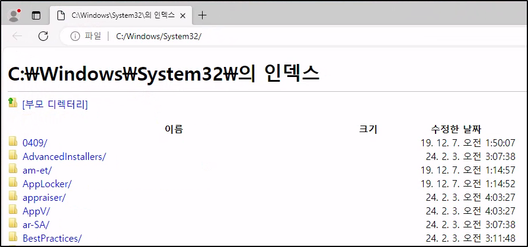
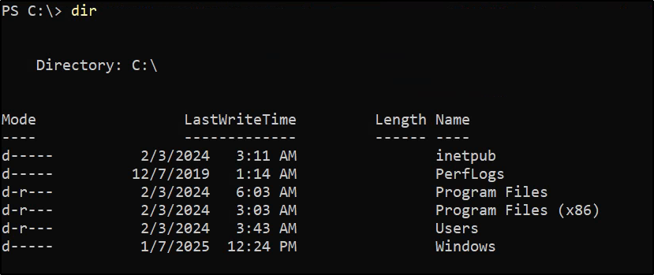
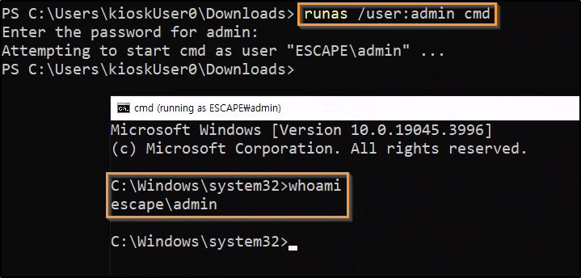
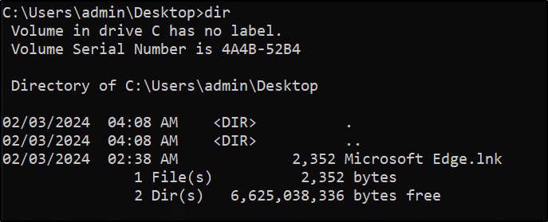

## Port Scanning

An initial Rustscan scan reveals:

```bash
rustscan -a 10.10.110.29 --ulimit 5000 --
```


Only the RDP port appears to be open. A more detailed Nmap scan shows the following information:

```bash
nmap -Pn -p3389 -A -T4 10.10.110.29
```


It seems RDP is the only port open.

## RDP Enumeration

Nmap has some RDP enumeration scripts that can gather more information:

```bash
nmap -p 3389 --script rdp-enum-encryption 10.10.110.29 -Pn
```


It shows it supports NLA as well as other information like early user auth, which supports authenticating users before the session is initialized.

Trying a standard RDP connection results in it asking for a domain name:

```bash
xfreerdp /v:10.10.110.29 /dynamic-resolution
```


Since NLA is use, a connection was made by disabling NLA:

```bash
xfreerdp /v:10.10.110.29 /dynamic-resolution -sec-nla
```


An RDP session opens, indicating it is a kiosk with standard user (KioskUser0) and no password. As a side note, login would now be possible with NLA due to knowing credentials:

```bash
xfreerdp /v:10.10.110.29 /dynamic-resolution /u:KioskUser0
```

## Initial Access Enumeration

After logon, a simple screen appears with a background image and text:


Various shortcuts and methods were attempted to get more access such as hitting CTRL+ALT+DEL which does work:


Using Google Translate, it reads as follows (top to bottom):

- Lock
- Log Out
- Change Password
- Task Manager

The lock, logout and change password options are of no interest, but task manager may be useful. Attempting to open Task Manager does not work sadly.

Moving on, a useful guide was hitting the Windows key produces the standard Windows menu:


Trying more suggestions from [HackTricks](https://book.hacktricks.wiki/en/hardware-physical-access/escaping-from-gui-applications.html#bypassing-path-restrictions), hitting Windows+F opened up a feedback window:


Clicking into Settings showed some possible links at the bottom that may open a browser, but they did not work in this scenario:


Going back to the Windows menu, Microsoft Edge can be opened:


## Edge Breakout Techniques


Searching around, [HackTricks](https://book.hacktricks.wiki/en/hardware-physical-access/escaping-from-gui-applications.html#accessing-filesystem-from-the-browser) has a section on accessing the file system from the browser with places to look as well as a good blog by [NVISO](https://blog.nviso.eu/2022/05/24/breaking-out-of-windows-kiosks-using-only-microsoft-edge/) which details breakouts using MS Edge.

Attempting to navigate to interesting directories such as `C:\Windows\System32` results in success and the file system can be navigated:




Depending on whether the Edge instance running now is locked down or not, another MSEdge window can be opened by trying to use various protocols in the URL bar such as `ftp://` which prompts Windows to ask what program should be used to open it:


It appears to allow Internet Explorer, Edge and the MS Store to be opened for FTP files:


The second window may now be completely unrestricted if any were in place to begin with.

Since access is allowed to the System32 directory seen above, a command prompt or PowerShell window can be attempted to be ran:


Unfortunately, an error occurs stating that the operation was cancelled due to system limitations, likely due to the kiosk mode not allowing execution of unwanted programs such as PowerShell and CMD:


In Edge, you can potentially open a Windows Explorer window by clicking the folder icon next to any of the files that have been downloaded which proves successful:


Trying to navigate to places on the file system in Explorer proves unsuccessful however, as an error message appears:


The error is similar to before - stating that it has been blocked and happens for every directory including our own desktop or home directory.

As a recap:

- File system navigation is possible through a MS Edge browser
- Explorer window is possible, but only in the Download directory

Testing the right click, it also appears to be disabled, not allowing accessing to the context menu. However, shortcuts appear to be working as CTRL+C/CTRL+V is possible to duplicate files in the current directory:


## Command Line Access

Remembering a video from John Hammond almost 3 years ago about kiosk breakouts, there was a simple technique - simply rename the `powershell.exe` to `msedge.exe` or an already allowed/whitelisted program.



If the system is only matching on the name of the executable itself and not the full path, it will allow execution of any renamed file.

Since MS Edge is allowed to run, the `cmd.exe` can be renamed to `msedge.exe` in the Downloads folder using the F2 keyboard shortcut:


Command line access is now present.

## CLI Enumeration

Running the `whoami` command, we are still the kioskuser0:


Checking our current user's desktop reveals a flag:


Attempting to look at the Administrator's folder results in an access denied:


Looking around for a bit in directories like:

- `C:\Windows\Tasks`
- `C:\Temp`
- `C:\Windows\Temp`
- `C:\Users\Public`

Resulted in nothing interesting. Looking at the base C: drive also results in nothing interesting:




Or does it.......? One thing to be aware of is there may be hidden folders that are lurking that will not appear from a simple `dir` command. To show them in PowerShell:

```powershell
Get-ChildItem C:\ -Hidden
```


A hidden `_admin` directory appears and did not show up due to the attributes being `d--h--` which indicate a directory and hidden.

## Admin Folder Enumeration

Enumerating the admin folder shows an installers and a passwords folder, but these both appear to be empty:


The only non-empty file/folder in this directory is the `profiles.xml` file. Reading the contents reveals a profile name, username and password with a comment stating "Remote Desktop Plus":


Doing research, it appears to be a legitimate program:


## Remote Desktop Plus

Running a PowerShell one-liner, we can search for Remote Desktop Plus on the system:

```powershell
Get-ChildItem -Path C:\ -Filter "Remote Desktop Plus" -Recurse -ErrorAction SilentlyContinue -Force
```


Navigating to the directory shows an EXE available. Running it creates a popup for the program itself:


There is an option to "Manage profiles" which allows you to import profiles. Since it opens Explorer.exe to search for the file, we cannot navigate to the `C:\_admin` directory.

To solve it, we can copy the profiles.xml to the Downloads directory which we do have access to in Explorer:


After importing the profile, it appears in the profiles section, but the password is protected:


## Extracting Credentials

One thing I like to do is search GitHub for the program and see what comes up:




There appears to be a program that exploits it by decrypting temporary `.rdp` files in a temp directory. After fighting with Visual Studio, .NET Framework and SDK versions, the compiled EXE now runs:


To execute locally, I spun up a Windows VM and transferred the `profiles.xml` over to it. Once there, Remote Desktop Plus was downloaded which resulted in a `rdp.exe` file as above.

While SharpRDPlusSnatcher was running, the profile was imported and the "Connect" button was clicked:


A cleartext password is returned.

## Privilege Escalation

While the profile name was "admin", it's good to confirm if there is a user of this name or similiar like "Administrator":

```powershell
net user
```


Since this is a perfect match, it can be tested for password re-use, although the RDP was for the localhost anyways so it likely works. Before continuing, we can check if the `admin` user is in the Administrators group:

```powershell
net user admin
```


To get an elevated CMD prompt as the new admin user, `runas` can be used:

```powershell
runas /user:admin cmd
```




## Root Flag

Searching for the root flag in the Desktop folder for `admin` results in no luck:




Attempting to view the Administrator folder results in an access denied error:


Checking the privileges via `whoami /all` reveals that the BUILTIN\\Administrators group has the attribute of "Group used for deny only":


Performing some research on my local machine, I opened a terminal and ran the same command and got the same results:


However, running the command as administrator prompted a UAC, but afterwards, it appeared full permissions were present:


This lead me to think about a potential UAC bypass of some sort. Further research, I came across a [blog post](https://harshit3.medium.com/bypassing-windows-uac-2d9f232702d7) that describes tokens well and talks about UAC preventing administrative tasks since it is using a filtered token.

## UAC Bypass

One way to confirm UAC is present on the system is via a one-liner:

```powershell
REG QUERY HKEY_LOCAL_MACHINE\Software\Microsoft\Windows\CurrentVersion\Policies\System\ /v ConsentPromptBehaviorAdmin
```


The value of 5 means that it prompts for consent when running as an administrator, meaning UAC is present.

Since GUI access is present via RDP, an easy way to trigger a UAC prompt is via:

```powershell
start-process cmd.exe -verb runas
```

This starts a new process (CMD) and specifies that the process is started with elevated privileges (run as administrator). Since UAC is on for "running as administrator" actions, it appears:


After clicking Yes, a new CMD opens with full administrative privileges:


