## Port Scanning

An initial Rustscan scan reveals:

```bash
rustscan -a sync.vl --ulimit 5000 --
```

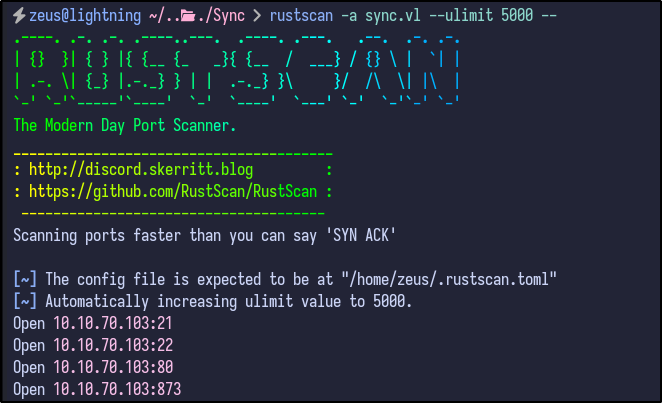

A few ports appear to be open, including FTP, SSH, HTTP and port 873. A more detailed Nmap scan shows the following information:

```bash
nmap -A -T4 -p21,22,80,873 sync.vl
```

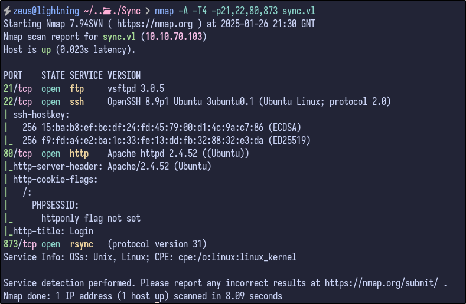

Some more useful information, but nothing that can be used directly, although does show Rsync is the service running on port 873.
## FTP Enumeration

Since FTP is open, anonymous FTP login was attempted but this failed:

```bash
ftp sync.vl
```

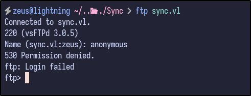

Some other default creds or common creds were also attempted such as `root:root`, `admin:admin` and so on, but no success.
## HTTP Enumeration

Visiting the web page reveals a simple looking login page:

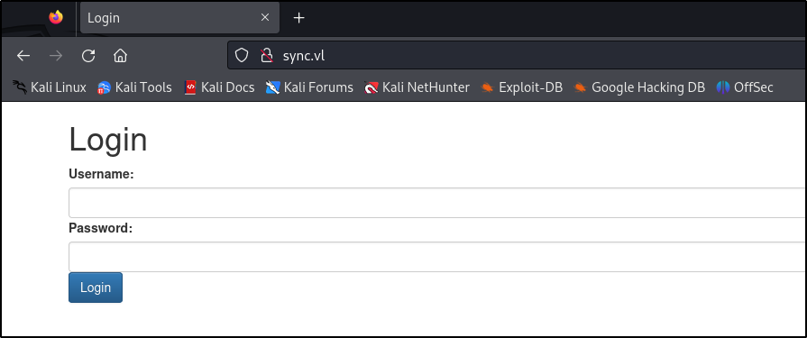

Again, attempting default/common credentials results in no success:

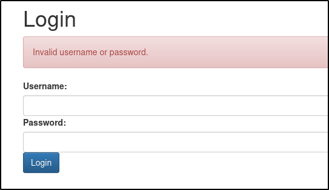

Attempting a basic SQLi authentication bypass payload as the username such as `' OR 1=1--` results in a successful bypass and shows a dashboard with some statistics:

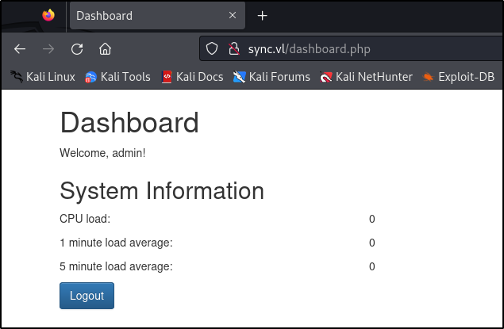

There appears to be no other interesting functionality and checking the source code, there is also nothing interesting:

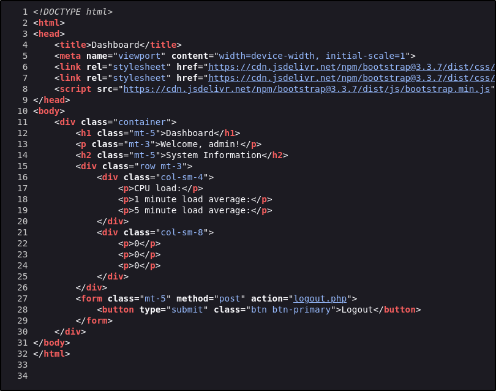
### Directory Busting

Running `dirsearch` with the cookie provided results in no interesting files being found for further enumeration:

```bash
dirsearch -u http://sync.vl/ --cookie "PHPSESSID=[VALUE]"
```

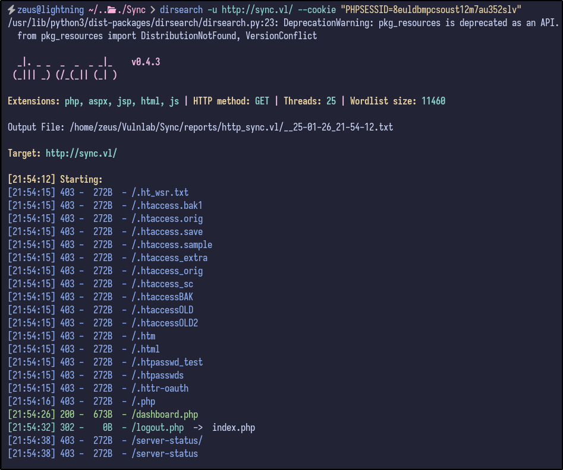

It appears to be a dead-end for now.
## Rsync Enumeration

With Rsync being open, Netcat can be used to query for any information regarding the service:

```bash
nc -nv sync.vl 873
```

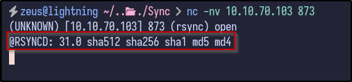

It returns a version of Rsync - 31.0. Since Rsync has been identified as running, the `rsync` command can be used to interact with the service. For example, by running `rsync 10.10.70.103::`, it may return with available directories:

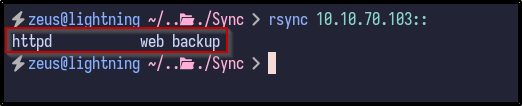

Since it returns some information, it means the service allows anonymous unauthenticated access.
### Httpd Share

With a share name of `httpd`, the contents can potentially be listed out via the following `rsync` command:

```bash
rsync -av --list-only rsync://10.10.70.103/httpd
```

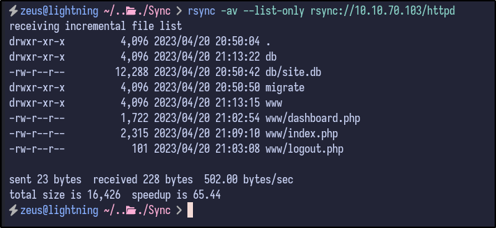

The contents are interesting - it appears to be the website directory since it includes the PHP files seen during the web enumeration - index.php, logout.php and so on. If so, it may be possible to upload a PHP web shell to the share and navigate to it via `rsync`:

```bash
rsync testfile 10.10.70.103::httpd
```

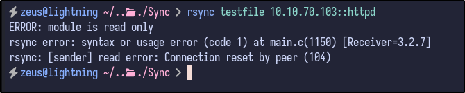

Unfortunately, it is read-only. In this case, all the files can be downloaded and enumerated locally via the following:

```bash
rsync -av rsync://10.10.70.103/httpd .
```

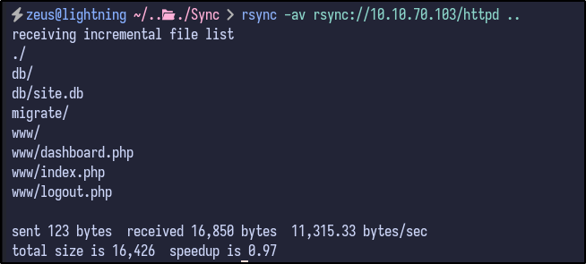
## SQLite3 File Enumeration

With the files locally downloaded, they can be enumerate further. Since the website seemed to be a dead end and SQL injection was already identified, these files can be looked at as a last resort.

Additionally, the migrate folder is empty - leaving one folder of interest - `db`. Inside the folder, there is one SQlite3 database:

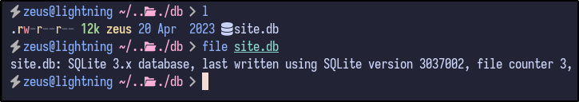

Opening the database reveals a users table with two user password hashes - `admin` and `triss`:

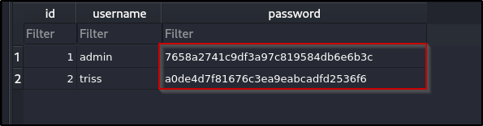

Attempting to crack these MD5 hashes with Hashcat results in no success:

```bash
hashcat -a 0 -m 0 hashes.txt /usr/share/wordlists/rockyou.txt
```

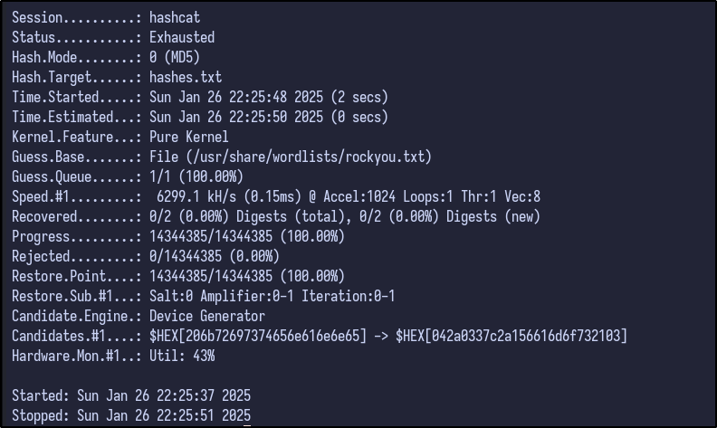
## Hash Identification

Using an online tool such as [Hash Identifier](https://hashes.com/en/tools/hash_identifier)  returns various possible algorithms used including MD5, but also MD5 with a potential salt value:

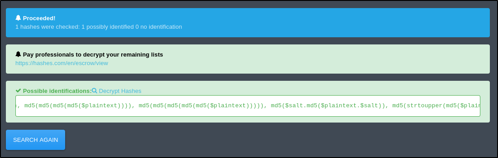

Knowing this, the source code can be viewed for any indication of libraries or custom implementations for how the passwords are hashed. Checking the `index.php` file reveals the following lines at the top:

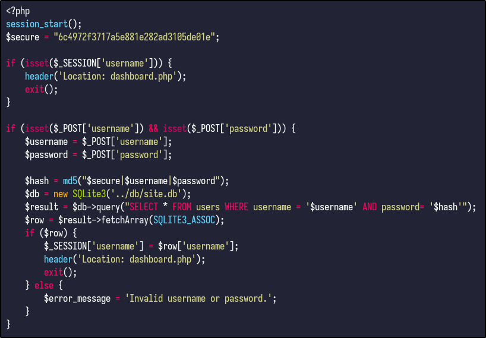

The code does the following:

- The `$secure` variable declares a hardcoded string value used later
- The next 4 lines state that if the session variable username is set, it means the user is logged in and redirects to `dashboard.php` and `exit()` stops the script executing further.
- The next 3 lines handle the login form submission - it checks if the login form is submitted and verifies if the username and password are present in the request. The creds are stored in variables titled `$username` and `$password`.
- The `$hash` variable combines the `$secure` string, username, and password into one and generates an MD5 hash.

The rest is fairly simple and you can see where the SQL injection takes place.
### SQL Injection Explained

The following line is vulnerable:

```php
$result = $db->query("SELECT * FROM users WHERE username = '$username') AND password= '$hash'");
```

If you inject the payload from before - `' OR 1=1 --`, it would result in the following query:

```sql
SELECT * FROM users WHERE username = '' OR 1=1 --'; AND password= '...';
```

Which would always return true for the username condition, bypassing the authentication.
## Cracking The Hash

Since the hardcoded string is present and is used for every password hash, it can be used to crack the hashes from the database. Hashcat has a mode - 20 - that has a format including the salt:

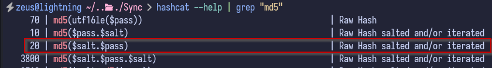

With the mode, salt, hash and username, a `hashes.txt` file can be created with both hashes in the required Hashcat format:

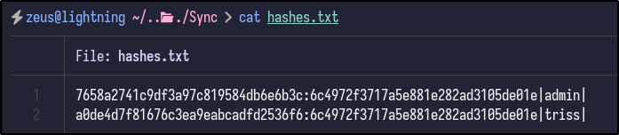

Finally, Hashcat can be run with the following syntax to attempt to crack the hashes:

```bash
hashcat -a 0 -m 20 hashes.txt /usr/share/wordlists/rockyou.txt
```

After a few seconds, a password for `triss` is returned:

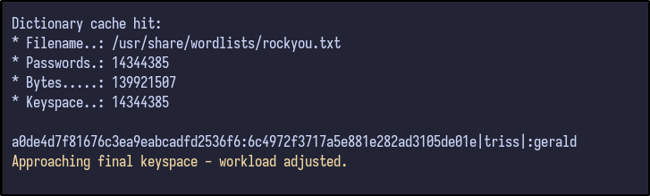
## SSH Access

With new creds, an SSH connection was attempted, but failed as the `triss` user:

```bash
ssh triss@sync.vl
```

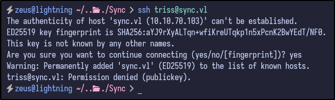
## Authentication FTP Enumeration

Since FTP was also open, the `triss` creds can be used to potentially gain access to FTP and enumerate further:

```bash
ftp sync.vl
```

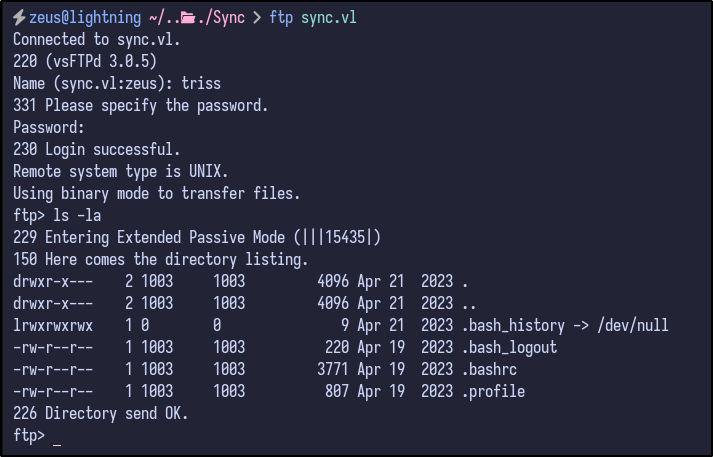

FTP access is confirmed and it appears to be a user's home folder indicated by bash history and various other dotfiles. Downloading the `.bash_history` file would be useless as it is empty and all contents are sent to /dev/null.

Since it appears to be a home folder, it may be possible to add a public SSH key to the `.authorized_keys` folder and allow ourselves SSH access if upload functionality is allowed.

Attempting to upload a random file such as `testfile` proves successful, meaning we have write privileges:

```bash
put testfile
```

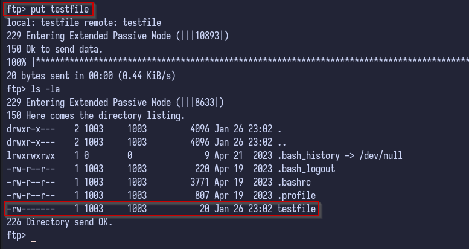

Then, your public SSH key can be copied into an `authorized_keys` file:

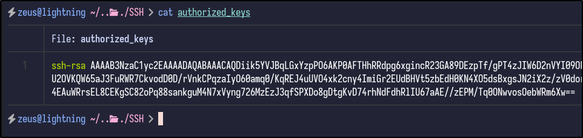

And finally uploaded to the victim's `.ssh` folder via FTP:

```bash
put .authorized_keys
```

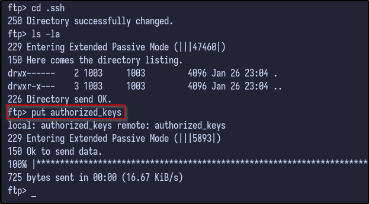

Now, we achieve full SSH access by using the private key on our machine:

```bash
ssh -i id_rsa triss@sync.vl
```

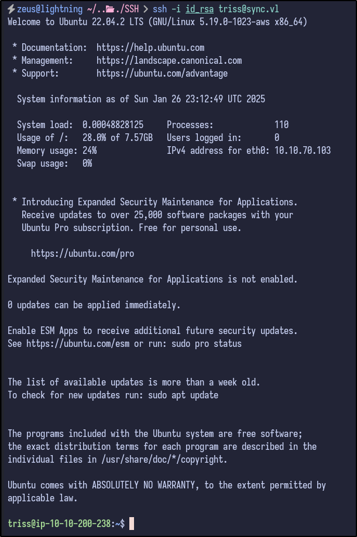
## Post Exploitation

Checking for easy wins via SUDO privileges results in no luck as `triss` cannot run sudo:

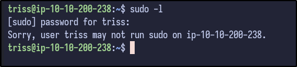

Checking the `/home` directory results in more users being present including `sa` and `ubuntu`:

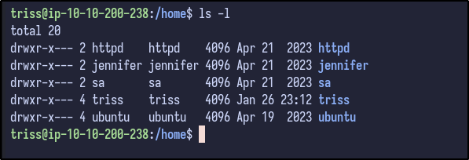
### Password Reuse

Since there are many users, there may be password reuse. Using a simple BASH one-liner to try running `su` with every user with the password found for `triss` results in one hit:

```bash
while read -r user; do echo "password" | su - "$user" -c "exit" 2>/dev/null && echo -e "\033[0;32m[+] Success: $user\033[0m" || echo -e "\033[0;31m[-] Failure: $user\033[0m"; done < users.txt
```

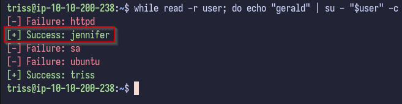
### Jennifer Enumeration

Switching to the `jennifer` user and looking inside the home directory results in nothing interesting apart from the user flag which can be grabbed:

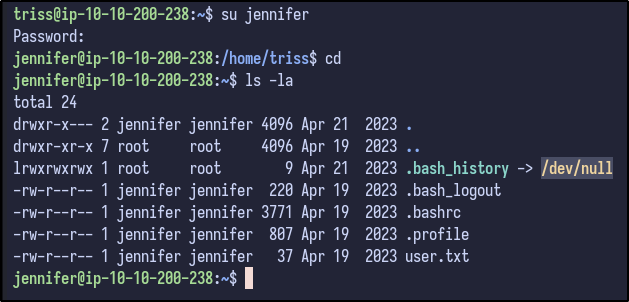
### LinPEAS Output

Checking the output of LinPEAS, there appears to be an unexpected folder in the `/` directory titled `backup`:

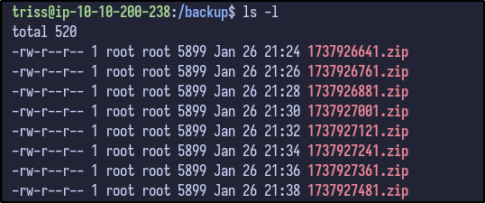

Analysing the timestamps, it appears to be running a backup script every 2 minutes.
### Backup Analysis

Downloading the latest ZIP file to our local machine and unzipping the contents reveals the following:

```bash
unzip [FILE].zip
```

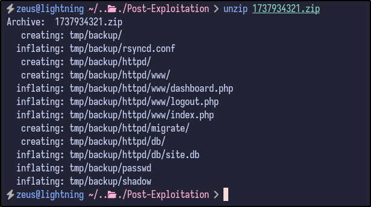

Two interesting files stand out:

- passwd
- shadow

Analysing the contents of the `passwd` reveal it to be the same file that is present on the machine with the same users seen before:

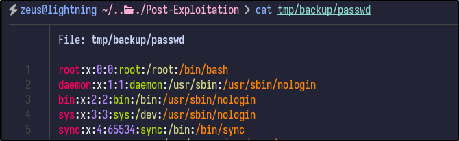

Since both the `passwd` and `shadow` files are present, the `unshadow` command can be used to combine them for potential cracking with John the Ripper:

```bash
unshadow passwd shadow > crackme
```

After combining, John the Ripper can be ran to try and crack the hashes for each user:

```bash
john crackme --wordlist=/usr/share/wordlists/rockyou.txt
```

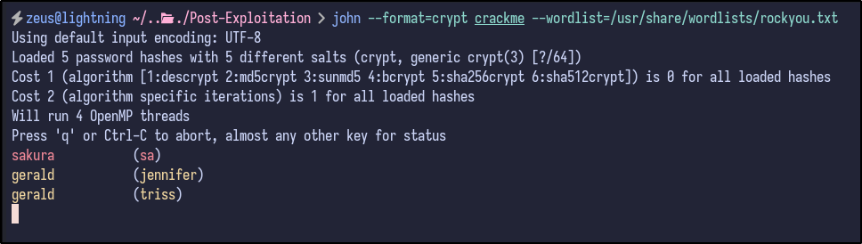
### SA User Enumeration

After switching users to `sa` and checking their home directory, nothing interesting is present:

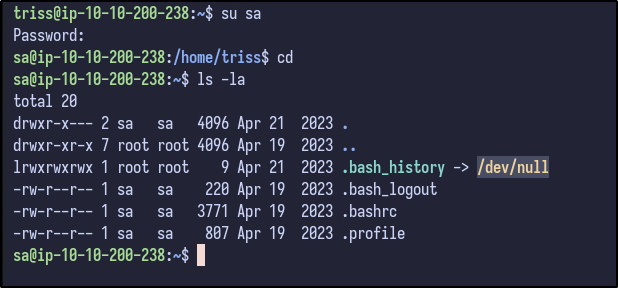

Since the password is known, `sudo -l` can be ran to determine any sudo privileges provided to the `sa` user:

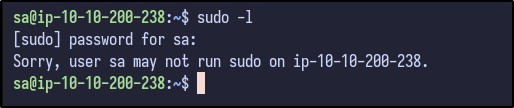

Running LinPEAS once more with this new user results in a new finding not seen before:

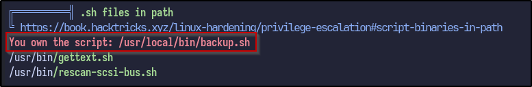

It appears the `sa` user owns the `backup.sh` script. Analysing the file reveals the following:

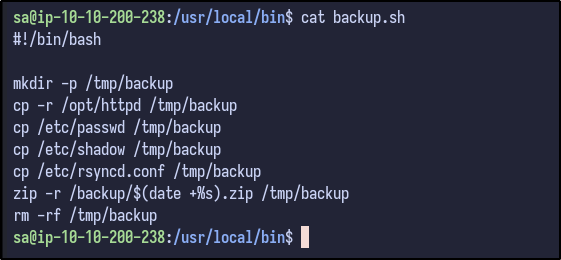
## Pwning Root

Since we saw the backup files earlier were generated every 2 minutes and owned by the `root` user, it can be guessed that this script creates the backup file and is run by root - if so, since we own the file as the `sa` user, it can be modified do various things.

One way is to run a command to create the `.ssh` directory inside the `/root` directory and echo in a public SSH key to the authorized_keys file

```bash
echo "mkdir -p /root/.ssh && echo '[PUBLIC-KEY]' >> /root/.ssh/authorized_keys" >> backup.sh
```

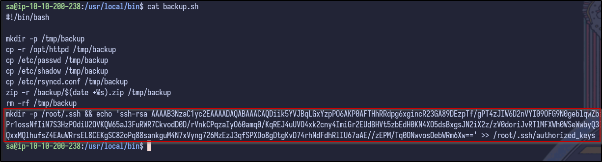

After waiting 2 minutes for the backup to be ran, SSH access is now possible via the root user:

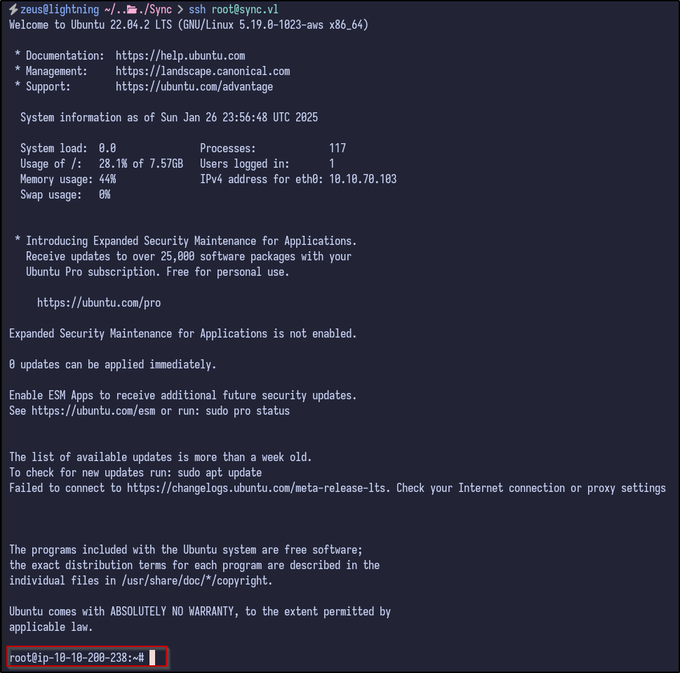